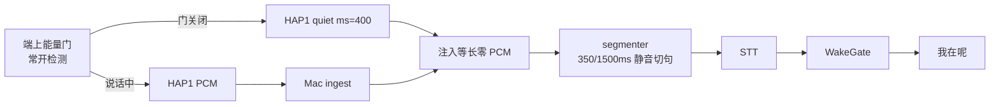

# 手机拾音「面条面条 → 我在呢」延迟优化 — v1

> 现象（用户）：`LivingRoomPickup`（客厅 iPhone 拾音）现在能听到声音了，但
> 「面条 面条」到听到「我在呢」的延时偏高。mac voice 之前优化过一次（USB 猎唤醒
> 静音 1000→400ms，见 [`usb_wake_latency_v1.md`](./usb_wake_latency_v1.md)），
> 这轮把两边策略对齐。

## 1. 实测证据（线上 mac_voice 日志，非推测）

样本：`~/artifact-storage/home-agent-gateway/logs/mac_voice.supervised.out.log`
（2026-09-19 17:3x–17:4x，真机 `192.168.3.60` participant=`living-room-pickup-*`）。

一次完整唤醒（17:39:42）：

| 时刻 | 事件 |
|------|------|
| 42.44 | segmenter 切句完成 → STT 发完最后一段音频 |
| 42.90 | STT `text='面条面条。'`（约 0.46s，与 USB 路径一致） |
| 42.90 | `wake waiting ack hits=2` → `phone_hap1 speak 我在呢`（1ms，本地 CAF 预加载） |

**切句之后只花 0.46s**——STT 与应答都不是瓶颈。瓶颈在「切句时刻」：

| 路径 | `reason=silence`（按静音切句） | `reason=max`（跑满 max_speech 才切） |
|------|------------------------------|-----------------------------------|
| `mac_usb` | 609 | 63 |
| `phone_hap1` | **10** | **107**（其中 **100 条正好 89600 字节 = 2.8s = `MAC_VOICE_PHONE_WAKE_MAX_SPEECH_MS`**）|

即：手机路径「几乎从不等静音」，每条 clip 都跑满 2.8s 才切。
用户说完「面条面条」到 clip 被切，平均要多等 ~1.4s、最坏 ~2.8s；
若唤醒词跨在两个 clip 上（`partial` 拼接），最坏要等两个 2.8s。

## 2. 根因（两条，都是「静音对 Mac 不可见」）

### A. 客户端能量门把静音「丢掉」了，而 Mac 的切句按**字节**数静音

`HomeMicEnergyGate` 关闭时不上传（省流量/老机省电）。于是 Mac 侧
`iter_utterances` 收到的码流里**没有静音字节**，`silent_run` 永远不涨 →
只能等 `max_speech_bytes`。切句是按「收到的字节」算的，手机一静音就等于时间停住。

### B. 手机 AGC 把环境噪声抬到 Mac 的「语音」区间

`HomeMicPcmCapture` 远场增益目标 RMS≈0.16（≈int16 5243）× 固定前级 2.6，
而手机路径的判决门限是固定的 `energy_threshold=1500 / start_threshold=2200`。
结果：房间底噪也被抬到 2200 以上 → Mac 认为「一直在说话」，
`_is_trailing_quiet` 永不成立（日志里 Mac 侧 `noise=438` 长期不动，
因为 level 从不低于 `max(noise*1.8, start_th*0.85)`）。
这就是“两边不对齐”的地方：**USB 麦是「连续、按真实时间的码流 + Mac 自适应能量门」，
手机是「只上传语音 + AGC 后固定门限」。**

## 3. 做法：把手机也变成「按真实时间的码流」，切句仍归 Mac

对齐 USB 的分工——**端上只负责「说出静音有多长」，切句/唤醒/指令胶合仍由 Mac 决定**：

1. **端上（LivingRoomPickup）**：能量门**继续常开检测**（与上传过滤解耦），
   在「说话结束、门关闭」那一刻发一个 HAP1 `quiet` 帧（type 5，`{"ms": 400}`），
   报告刚过去的静音时长（= hangover，≥400ms）。静音期间不上传音频（流量不变）。
2. **Mac ingest**：收到 `quiet` 帧 → 往切句队列里注入**等长零 PCM**。
   `silent_run` 于是按真实时间推进 → 350ms 唤醒静音立刻切句（和 USB 一样）。
3. **兜底（老端也生效）**：ingest 检测「码流停顿」——手机不再发 PCM 超过
   `stream_gap_ms`（默认 300ms）→ 按停顿时长注入零 PCM。
   旧版 App（没有 quiet 帧）也能拿到 ~`hangover(400)+350=750ms` 的切句延迟。
4. 单帧注入上限 `gap_cap_ms`（默认 900ms）：> 唤醒静音 350ms（保证一帧就能切唤醒），
   < 指令静音 1500ms（保证一帧永远不会把指令句切碎）。

切换点：`begin_command_listen` 之后用指令静音 1500ms，停顿继续按兜底注入累积到
1500ms 才切——与 USB 的「应答后指令开口才回落长静音」一致。



## 4. 预期效果

| 场景 | 现在 | 改后（新端 + 新 Mac） | 改后（老端 + 新 Mac） |
|------|------|----------------------|----------------------|
| 面条面条 → 我在呢 | 切句平均 +1.4s（最坏 2.8s）+ STT 0.46s | ~0.4s(端 hangover)+0.1s+STT 0.46s ≈ **1.0s** | ~0.75s + STT 0.46s ≈ **1.25s** |
| 指令句（应答后 5s 内） | 靠 12s max 兜底 | 1500ms 胶合，与 USB 同一套 | 同左 |

顺带收益：`_utterance_duration_ms` 不再恒为 2.8s，
`MAC_VOICE_DOUBLE_WAKE_MS`（≥1.1s 判两遍）不再被噪声灌水误判。

## 5. 不改

- STT 引擎/参数（`enable_nonstream`、`enable_ddc`）、WakeGate 状态机、5s 指令窗
- 端上 AGC 与 hangover(400ms)/pre-roll(280ms)（老机静音唤醒是上一轮的成果）
- 唤醒词、别名、其它 App（`HomeAgentPickup` 是另一套 `PcmEnergyGate`，另开）

## 6. 验收

- 单测：`mac/tests/test_mac_voice_pickup_gap.py`
  （帧编解码 / quiet→注入 / 停顿兜底注入 / 单帧上限 / 350ms 切唤醒 / 1500ms 不误切指令）
  —— 连同既有 mac 语音单测共 158 项全绿。
- **本机端到端实跑**（假手机 HAP1 → 改后 ingest → 切句 → 真 Volc STT → WakeGate）：

  ```
  [ 1.39s] phone: 说话结束 → 静音门关闭
  [ 1.65s] Mac: clip 切出 1200ms → STT      (说话结束后 0.26s)
  [ 1.80s] phone: 已发 HAP1 quiet 帧（400ms）
  [ 2.25s] Mac: STT='嗯，面条面条' → gate hits=2 → 发「我在呢」
  ```

  即：**切句 0.26s + STT 0.46s ≈ 0.86s** 到应答（改前这条 clip 会跑满 2.8s，
  说话结束后还要等 ~1.7s 才进 STT，端到端 ~2.2s）。
- **STT 精度对照**（同一句 `say -v Tingting 面条面条`，真 Volc）：
  只含语音的 1.12s clip → `'面条面条。'`（hits=2），与旧的 2.72s 补噪声 clip 完全一致
  —— 切短不会伤唤醒识别。
- 真机复验：Log 里 `reason=max ~2.8s` 变成 `reason=silence ~1.x s`，
  `phone_hap1 quiet frame` 与 `wake ack via phone_hap1` 间隔 < 0.6s，
  `phone_hap1 alive ... gaps=N gap_total=…s` 能看到注入量。

## 7. 非本轮

- `HomeAgentPickup`（另一套 `PcmEnergyGate`/`AudioPickupClient`）未改；
  `server/audio_pickup.py` 的中转只转发 PCM/HELLO，quiet 帧不透传
  （走中转的老端仍靠「码流停顿」兜底，行为同旧端）。
- 端上 AGC 目标（0.16 RMS）偏热，会把房间底噪抬进 Mac 的固定门限区间；
  本轮改为不依赖 Mac 的能量判决，故不动 AGC。
- STT 流式提前判定唤醒（不等 final）留待后续。
