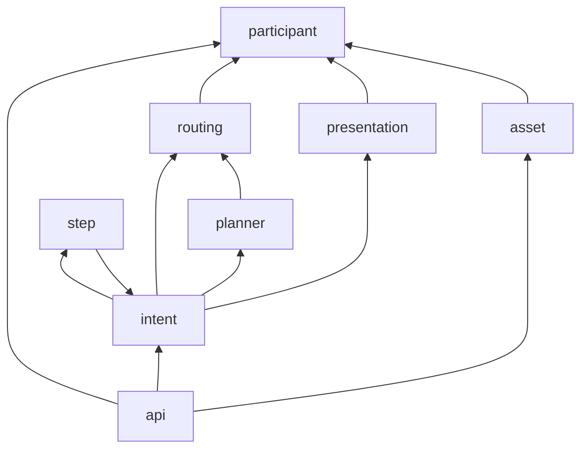

# Brain 复杂度整改优化方案

> **状态：** 规划文档（v0.1）  
> **范围：** `server/home_brain.py` 及 Brain 控制面周边  
> **约束：** 不改对外 API 契约、不改 plugin/runtime 契约；单轮主链路优先于多轮扩展  
> **关联：** [`dual-brain-runtime.md`](dual-brain-runtime.md)、[`three-consoles-debug-gateway.md`](three-consoles-debug-gateway.md)、[`../participant-model.md`](../participant-model.md)、[`../db-schema.md`](../db-schema.md)

## 1. 背景与目标

### 1.1 问题陈述

`home_brain.py` 是当前 Brain **唯一生产入口**（`brain_app.py` 仅转调），已膨胀至 **~8k 行 / 302 个符号 / 66 条路由**。近期 incident（双 Brain 路由、intent 333 orphan 复活、document.scan 黑盒卡 `intent_parsed`）暴露出：

| 症状 | 根因类型 |
|------|----------|
| 修一处状态机牵动多处 | **职责耦合**：intent 生命周期、step 回调、presentation 组装、orphan 对账同文件交织 |
| 黑盒/单测难定位责任层 | **边界模糊**：规划、选边、资产授权、Admin API 混在同一 import 图 |
| 新能力/shortcut 不敢动 | **回归面过大**：`test_home_brain.py` 已 **~5k 行**，任何小改都可能触发全量 Flask 集成测 |
| 已抽模块仍被 monolith 牵着走 | **抽取不彻底**：`dev_task` / `debug_gateway` / `intent_complexity` 等已独立，但路由与 glue 仍堆在 `home_brain.py` |

用户要求的是 **复杂度整改**，不是加功能。当前阶段架构基线（[`dual-brain-runtime.md`](dual-brain-runtime.md) §2）明确：**先把 Single-Turn 主链路的 Edge Case 吸收进既有抽象，而不是继续堆特殊分支**。本方案与此一致。

### 1.2 目标（可度量）

| 指标 | 现状（2026-08） | 阶段目标（P2 结束） | 终态目标（P4） |
|------|-----------------|---------------------|----------------|
| `home_brain.py` 行数 | ~8,035 | ≤4,500 | ≤2,500（仅 app 引导 + 路由注册） |
| 单文件符号数 | ~302 | ≤120 | ≤60 |
| 核心域模块单测（不启 Flask） | 零散 | planner / routing / intent_fsm 各有独立测 | 同上 + 契约快照测 |
| 新 incident 定位时间 | 常需全文搜索 | 按包名 1 跳到域 | 按包名 + 状态图文档 |

### 1.3 非目标

- **不**拆成多进程 Brain（Local / Cloud 仍是同一 codebase、不同 `BRAIN_ORIGIN` 部署实例）。
- **不**在本轮做 DB schema 大改（归 `@dba` 单独立项）。
- **不**把 Admin HTML 塞回 Brain（继续 `admin/serve.py` 本机 8788 代理 `/api/v1/admin/*`）。
- **不**借机重写 planner prompt 或 capability 契约。
- **不**启动多轮 Session 架构（与 dual-brain 文档 §2 一致，延后）。

---

## 2. 现状剖面

### 2.1 体量分布（估算行段）

```
home_brain.py (~8035 lines)
├── 配置 / 日志 / 缓存 / 全局队列          ~300
├── Participant / Endpoint / Presentation  ~1,600   ← 应独立
├── Plan 清洗 / shortcut 折叠 / 资产 token  ~600
├── Presentation 组装                      ~300
├── Planner / LLM worker (Ark + Qwen)      ~1,680   ← 应独立
├── 选边 / capability 路由                 ~400
├── Intent 派发 / 复杂度观测               ~570
├── Step 状态机 / system 步 / finalize     ~520    ← 应独立（高 incident 区）
├── 上传 / Asset CRUD / 授权 / 代理        ~2,480   ← 应独立
├── Admin API 路由 + glue                  ~1,350   ← 路由迁 Blueprint，逻辑已部分外置
├── Edge 注册 / 心跳 / capability map      ~590
└── 启动 / orphan 对账 / boot              ~150
```

### 2.2 已抽取模块（正例，继续沿用）

| 模块 | 行数 | 职责 |
|------|------|------|
| `intent_complexity/` | ~560 | 复杂度分类（observe-only），**不得**再内联回 `home_brain.py` |
| `shortcut_mode/` | ~350 | Reading 等 shortcut 拦截 |
| `system_capabilities.py` | ~827 | `kind=system` 步就地执行 |
| `dev_task.py` + 子模块 | ~1,500+ | Dev Task 存储与轮询 |
| `debug_gateway.py` | ~313 | User → Dev 报障链路 |
| `release_pipeline.py` | ~601 | `[release]` 节点与 Deploy Tab |
| `agent_chat.py` / `docs_browser.py` | ~400 | Admin 辅助面 |
| `db.py` | ~2,473 | SQLite 访问（Brain 不建库） |
| `prompts/task_planner_system_prompt.md.en` | 外置 | 规划器唯一 system prompt 源 |

### 2.3 复杂度驱动因素（按优先级）

1. **Intent 有限状态机（FSM）分散** — `dispatch_intent` → `llm_worker` → `do_execution_plan` → `notify_step_status_update` → `notify_intent_status_update` → `_maybe_finalize_intent_after_step` → `_reconcile_orphan_jobs`；终态守卫（如 failed 不可 succeeded）曾散落在多处。
2. **Presentation 与 Execution 双轨** — `assemble_presentation`、`_append_issuer_speak_step`、endpoint 匹配与 plan 清洗交叉依赖。
3. **Asset 子系统内嵌** — 上传、img-server 代理、ACL grant、stream、entity 视图共 ~2.5k 行，与 intent 生命周期无关却同进程同文件。
4. **Admin 路由面过宽** — 20+ `/api/v1/admin/*` 路由注册在 monolith；业务已外置，路由层未外置。
5. **测试策略放大变更成本** — `test_home_brain.py` 巨型集成测掩盖了可单测的纯函数（plan sanitize、edge assign、FSM 转移表）。
6. **隐式全局状态** — `mock_cache`、`capability_edge_mapping`、内存 mode、`commands_queue` 与模块级锁，难以做域级隔离测试。

---

## 3. 设计原则

1. **Strangler Fig（绞杀者）** — 每次只迁一个垂直切片；`home_brain.py` 保留 re-export 与路由注册，旧符号 deprecated 一版后删除。
2. **域边界 = 变更原因** — 按「为何修改」分包，而非按技术层（utils/helpers）分包。
3. **FSM 显式化** — intent / step 状态转移表 + 单一入口 `apply_transition()`；禁止在路由 handler 内直接改 `intent_status`。
4. **对外契约冻结** — URL、JSON 字段、HTTP 码不变；重构只动内部 import 路径。
5. **Planner 规则只改 md** — 继续遵守 `planner-prompt-source.mdc`；代码侧只做「调用 + 解析 + 校验」。
6. **测试金字塔** — 新模块先写无 Flask 单测；集成测只保留 API 烟雾与回归金样例。
7. **Dual Brain 友好** — 抽出的域模块不得假设「全局唯一 Brain 实例」；`intent_origin` / `BRAIN_ORIGIN` 由入口注入。

---

## 4. 目标模块结构

```text
server/
├── home_brain.py              # 薄入口：Flask app、Blueprint 注册、worker 启动、re-export（目标 ≤2500 行）
├── brain_app.py               # 不变
├── brain/
│   ├── __init__.py            # create_app() 工厂（可选，P3）
│   ├── config.py              # 环境变量、BRAIN_ORIGIN、TTL
│   ├── logging.py             # init_brain_logger
│   ├── intent/
│   │   ├── dispatch.py        # POST /intent、voice wake、shortcut 汇入
│   │   ├── fsm.py             # 状态转移表、终态守卫、orphan 策略接口
│   │   ├── persist.py         # get/save/update intent（薄封装 db）
│   │   └── finalize.py        # _maybe_finalize_intent_after_step
│   ├── planner/
│   │   ├── ark.py             # call_ark、cache、extract_llm_*
│   │   ├── qwen_shadow.py     # Qwen 对照队列（不入执行路径）
│   │   ├── plan_build.py      # make_execution_plan、sanitize、shortcut fold
│   │   └── worker.py          # llm_worker / qwen_llm_worker
│   ├── routing/
│   │   ├── edge_select.py     # _assign_runtime_edge_id、online_capability_providers
│   │   ├── capability_map.py  # rebuild_capability_maps
│   │   └── system_steps.py    # try_run_system_steps（调用 system_capabilities）
│   ├── presentation/
│   │   ├── assemble.py        # assemble_presentation
│   │   ├── endpoint.py        # endpoint 匹配、channel、registry
│   │   └── speak_delivery.py  # notify.speak / wake echo 附加
│   ├── participant/
│   │   ├── registry.py        # 注册、心跳、can_participate
│   │   └── policy.py          # control / exposure policy
│   ├── asset/                 # 或 server/asset_manager/（与 asset-contract 对齐）
│   │   ├── upload.py
│   │   ├── acl.py             # grant / may_read
│   │   ├── views.py             # list/get/stream API 实现
│   │   └── storage.py           # local / img-server
│   ├── step/
│   │   ├── callbacks.py       # notify_step_status_update、notify_intent_status_update
│   │   └── delivery.py        # notify_delivery_complete
│   └── api/
│       ├── intent_routes.py
│       ├── edge_routes.py
│       ├── asset_routes.py
│       ├── catalog_routes.py    # services / capabilities / edges
│       └── admin_routes.py      # 注册 admin Blueprint（glue 到 dev_task 等）
├── intent_complexity/         # 保持独立
├── shortcut_mode/             # 保持独立
├── system_capabilities.py     # 保持独立
└── tests/
    ├── test_intent_fsm.py     # 新增
    ├── test_plan_build.py     # 新增
    ├── test_edge_select.py    # 新增
    └── test_home_brain.py     # 逐步瘦身，保留 API 烟雾
```

**依赖方向（禁止环）：**



---

## 5. 分阶段实施计划

### P0 — 基线与守卫（1–2 周，低风险）

**目的：** 冻结现状、补文档、让后续搬迁可测。

| 项 | 动作 | 产出 |
|----|------|------|
| P0.1 | 在 `brain/intent/fsm.py` **新建**转移表（先从现有逻辑抄录，不删旧代码） | `INTENT_TRANSITIONS` dict + 单测覆盖 failed↔succeeded、orphan |
| P0.2 | 为 plan 清洗 / 选边各加 **≥10 个纯函数单测**（从 `test_home_brain` 抽案例） | `test_plan_build.py`、`test_edge_select.py` |
| P0.3 | 本文档评审 + `server/README.md` 增链 | 团队对齐 |
| P0.4 | 度量脚本：`scripts/brain_complexity_report.py`（行数、import 图、路由清单） | CI 可选 warn threshold |

**验收：** 新单测绿；`home_brain.py` 行数可暂不变；intent 333 类 orphan 回归用例入库。

**Owner：** `@brain` 实现；`@quality` 抽 2 条黑盒烟雾确认无行为变化。

---

### P1 — 垂直切片：Intent FSM + Step 回调（2–3 周）

**目的：** 消化最高 incident 密度区（#63 intent 333 orphan 复活）。

| 项 | 动作 |
|----|------|
| P1.1 | 迁 `notify_step_status_update` / `notify_intent_status_update` / `_maybe_finalize_intent_after_step` → `brain/step/` + `brain/intent/fsm.py` |
| P1.2 | 所有 `update_intent_status` 调用改走 `fsm.apply_intent_transition()` |
| P1.3 | `_reconcile_orphan_jobs` 迁 `brain/intent/orphan.py`；与 FSM 共用终态定义 |
| P1.4 | `home_brain.py` 保留 thin wrapper `@app.route` → 调新模块 |

**验收：**

- `test_home_brain.HomeBrainPersistTest` 全绿 + 新增 FSM 单测。
- 黑盒：`intent` 派发 → step 成功/失败/超时 orphan 三条路径。

**风险：** 行为回归。缓解：先 wrapper 双写日志对比 1 版，再删旧路径。

---

### P2 — 垂直切片：Planner + Routing（2–3 周）

**目的：** 隔离 LLM 与选边；为 shortcut / complexity 扩展减负。

| 项 | 动作 |
|----|------|
| P2.1 | 迁 `call_ark` / `llm_worker` / `extract_llm_*` / `make_execution_plan` → `brain/planner/` |
| P2.2 | 迁 `_assign_runtime_edge_id` / `online_capability_providers` / `rebuild_capability_maps` → `brain/routing/` |
| P2.3 | `dispatch_intent` 瘦身为编排：complexity observe → shortcut intercept → enqueue planner |
| P2.4 | `home_brain.py` ≤4,500 行 |

**验收：** planner cache 测、shortcut 测、capabilities 黑盒选边测不变。

---

### P3 — 垂直切片：Asset + Admin 路由（3–4 周）

**目的：** 去掉 monolith 中最大块（~3.8k 行合计）。

| 项 | 动作 |
|----|------|
| P3.1 | Asset 上传/ACL/views → `brain/asset/`（或独立 `asset_manager/`，与 [`asset-contract.md`](../asset-contract.md) 对齐命名） |
| P3.2 | Admin 路由 → `brain/api/admin_routes.py` Blueprint；handler 继续委托 `dev_task` / `agent_chat` 等 |
| P3.3 | Participant/Endpoint → `brain/participant/` |
| P3.4 | 可选：`create_app()` 工厂，`brain_app.py` / `home_brain.py` 只调工厂 |

**验收：** asset 黑盒、admin dev_task API、document.scan 全链（routing 已对齐后）。

---

### P4 — 收尾与治理（持续）

| 项 | 动作 |
|----|------|
| P4.1 | 删 `home_brain.py` 已迁符号；保留 `from brain.api import register_routes` |
| P4.2 | `test_home_brain.py` 拆包，目标 ≤1,500 行集成测 |
| P4.3 | CI：`home_brain.py` 行数 gate（fail >2,800） |
| P4.4 | 架构决策记录 ADR：`docs/architecture/adr/` |

---

## 6. 关键域设计要点

### 6.1 Intent FSM（P1 核心）

**状态（已有，显式化）：** `intent_received` → `intent_parsed` → `running` → `succeeded` | `failed`（+ 内部 `queued` 等若存在）。

**规则（来自 incident 沉淀）：**

```text
1. terminal(intent) ∈ {succeeded, failed} → 拒绝一切 step 状态写回
2. failed → succeeded 禁止（notify_intent 与 late step 双入口统一）
3. succeeded 时 pop 陈旧 msg/error（orphan 文案不得残留 presentation）
4. orphan reconcile：仅对 running + 超时 job；不得覆盖已 terminal 的 intent
```

建议实现：

```python
# brain/intent/fsm.py（示意）
TERMINAL = frozenset({"succeeded", "failed"})

def apply_intent_transition(intent, *, to_status, source, msg=None) -> TransitionResult:
    """Single entry for all intent status changes."""
```

### 6.2 Planner 边界

- **内：** prompt 组装、Ark HTTP、解析 JSON plan、校验 capability_id、attach `assigned_edge_id` 前调用 routing。
- **外：** 不执行 capability；不读 step_outputs 做 hydrate（归 runtime）。
- Qwen shadow **不得**阻塞 Ark worker（保持现有双队列）。

### 6.3 Asset 边界

- Brain 管 **元数据 + ACL + 代理 URL**；字节存储可走 local / img-server（现有逻辑）。
- Capability 步只传 `asset_id`（[`asset-contract.md`](../asset-contract.md)）。
- `list_assets_view` 与 intent grant 解耦为 `acl.grant_for_plan(intent_id, plan)`。

### 6.4 Admin 与三 Console

- Admin API 留在 Brain 进程（云 Brain 提供 JSON API），HTML 仅 `admin/serve.py`。
- Dev Task / Debug / Release / Agent Chat **逻辑已外置**；P3 只迁路由注册，不重写业务。

### 6.5 Dual Brain

- 抽模块时禁止硬编码 `192.168.x` / 云 IP；`intent_origin` 入库已有。
- 文档化：**客户端 auto 模式必须知悉两路 pull**（见 runtime #46）；Brain 整改不替代 routing 对齐，但 FSM/planner 代码共享可减少「只修了一边」概率。

---

## 7. 测试策略

| 层级 | 覆盖 | 工具 |
|------|------|------|
| L1 纯函数 | FSM 转移、plan sanitize、edge scoring | `unittest`，`BRAIN_SKIP_LLM_WORKER=1` |
| L2 模块 | planner 解析、asset ACL | mock Ark / tmp sqlite |
| L3 API 烟雾 | `/intent`、`/intent_detail`、step callback | Flask test client，少量金样例 |
| L4 黑盒 | 对外行为、双 Brain 路由 | `@quality` → `tests/blackbox/` |

**从 `test_home_brain.py` 迁移原则：** 每迁一个函数，先复制相关用例到新文件，绿后再删旧用例；禁止大爆炸删除。

---

## 8. 风险与缓解

| 风险 | 影响 | 缓解 |
|------|------|------|
| 重构引入行为回归 | 生产 intent 异常 | 分阶段 + FSM 单测 + quality 黑盒门禁 |
| import 环 | 启动失败 | 严格依赖图；`api` 层最后注册 |
| 双 Brain 部署不同步 | 一边修一边没修 | `[release]` 节点齐全再报上线；LAN/Cloud 同 sha |
| 范围蔓延（顺手改 planner） | 延期 | 非目标清单 + coordinator 仲裁 |
| `db.py` 继续膨胀 | 耦合 | Brain 域模块只通过 `brain/intent/persist.py` 访问 jobs 表 |

---

## 9. 分工与协调

| 阶段 | 主责 | 协作 |
|------|------|------|
| P0–P2 | `@brain` | `@quality` 回归；`@dba` 仅当 persist 层需新索引 |
| P3 Asset | `@brain` | 与 [`asset-manager-design.md`](../asset-manager-design.md) 对齐命名 |
| Admin 路由 | `@brain` | `@ui` 若 Dev Console 路径变更 |
| 部署 | `@deploy` | 每阶段 `committed → tested → deployed` |
| 架构争议 | `@coordinator` | 跨层拆单 |

---

## 10. 成功标准（结案条件）

1. `home_brain.py` ≤2,500 行，且 **无** 业务逻辑函数体超过 50 行（除路由注册）。
2. Intent FSM 有单测覆盖全部非法转移 + intent 333 orphan 回归。
3. `scripts/brain_complexity_report.py` 纳入发布前可选检查。
4. `tests/blackbox/` 关键路径（intent 派发、step 回调、asset 读）post-refactor 全 pass。
5. 团队评审记录：本方案 P0–P2 排期写入 [`daily-reports.md`](../daily-reports.md) 或 Dev Task。

---

## 附录 A：与「Intent Complexity Classifier」的关系

`intent_complexity/` 是 **observe-only** 分类器（SIMPLE/MEDIUM/COMPLEX），用于观测与后续路由策略；**不是**本次 monolith 拆分的第一优先级，但已符合「规则外置、不内联 home_brain」方向。P2 后可视产品需求接入「COMPLEX → 降级/拒单/人工」策略，**须单独立项**，不与结构重构混 PR。

## 附录 B：建议首批 PR 切分

1. `docs: brain complexity refactor plan`（本文档）
2. `brain: add intent FSM module + tests`（P0.1，无行为变更）
3. `brain: extract step callbacks to brain/step`（P1.1）
4. `brain: extract planner worker`（P2.1）
5. `brain: asset package extraction`（P3.1）

每个 PR：`[release] stage=committed` → `@quality` 烟雾 → `@deploy` 带 sha。

---

*文档作者：@brain · v0.1 · 2026-08-29*
