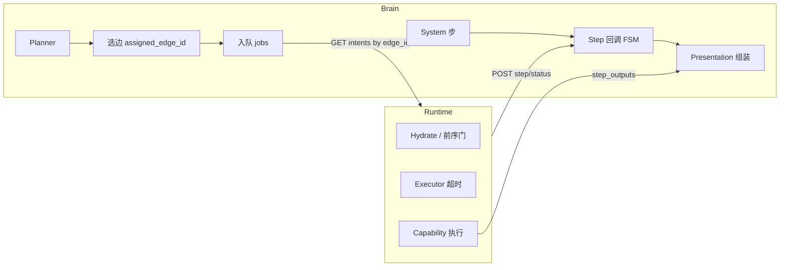

# Brain 简化整改方案

> **版本：** v1.0（规划-only，不改产品代码）  
> **路径：** `docs/architecture/brain-simplification-plan.md`  
> **主责：** `@brain`  
> **关联规范：** [`participant-model.md`](../participant-model.md)、[`asset-contract.md`](../asset-contract.md)、[`dual-brain-runtime.md`](dual-brain-runtime.md)、[`.cursor/rules/planner-prompt-source.mdc`](../../.cursor/rules/planner-prompt-source.mdc)、[`.cursor/rules/capability-independent.mdc`](../../.cursor/rules/capability-independent.mdc)

---

## 0. 摘要

Brain 控制面以 `server/home_brain.py` 为唯一生产入口，已膨胀至 **~8k 行 / 66 路由 / ~302 符号**，且 `test_home_brain.py` **~5k 行**。职责上本应只做「理解 → 规划 → 选边 → 入队 → 组装 presentation」，但实现上混入了 asset 存储代理、Dev Console Admin API、Dueros 兼容、orphan 对账等，导致可维护性、测试与部署风险同步上升。

本方案采用 **绞杀者式（Strangler Fig）模块拆分**：按变更原因划域，逐阶段把逻辑迁出 monolith，**冻结对外 API 与 participant/asset 模型**。不改 runtime plugin、不做多轮 Session、不把 planner 规则写回 Python。

---

## 1. 现状复杂度诊断

### 1.1 体量与结构

| 指标 | 数值 | 说明 |
|------|------|------|
| `home_brain.py` | ~8,035 行 | 单文件承载几乎全部 Brain |
| Flask 路由 | 66 条 | intent / edge / asset / admin / legacy skill |
| 顶层符号 | ~302 | def/class，认知与 review 成本高 |
| `test_home_brain.py` | ~5,035 行 | 巨型集成测，掩盖可单测纯函数 |
| 已外置模块 | ~6k+ 行 | `db.py`、`dev_task`、`system_capabilities` 等已抽，但 glue 仍回 monolith |

**行段分布（估算）：**

```text
home_brain.py
├── Participant / Endpoint / Presentation     ~1,600
├── Planner / LLM (Ark + Qwen shadow)         ~1,680
├── Asset 上传 / ACL / stream / entity        ~2,480
├── Admin API 路由 + glue                     ~1,350
├── Intent 派发 / 复杂度观测                  ~570
├── Step 回调 / FSM / system 步编排           ~520
├── 选边 / capability map                     ~400
├── Edge 注册 / 心跳                          ~590
└── 配置 / 缓存 / 启动 / orphan 对账          ~450
```

### 1.2 职责边界（设计 vs 实现）

按 [`participant-model.md`](../participant-model.md) 与 [`qc-design-charter`](../../.cursor/rules/qc-design-charter.mdc)，Brain **应**负责：

| 域 | Brain 职责 |
|----|------------|
| 规划 | LLM 调方舟 → `execution_plan`；prompt 仅来自 `server/prompts/*.md.en` |
| 选边 | 每步 `assigned_edge_id`；`capability_id → edge_id` last-writer-wins |
| 入队 | `intent_received` → `intent_parsed` → 下发 runtime 可见 job |
| Presentation | 步完成后组装 `intent_detail.presentation` |
| System 步 | `kind=system` 能力在 Brain 就地执行（`system` edge） |
| 注册/catalog | Edge 心跳、`services[]` / `capabilities[]` 目录 |
| Asset 元数据 | `asset_id` 注册、ACL、代理 URL（非 capability 内存储） |

Brain **不应**负责（但当前代码仍有越界或 glue）：

| 域 | 归属 | 现状问题 |
|----|------|----------|
| Step hydrate / 前序门 | **Runtime** | Brain 侧 `step_outputs` 读取仅用于 presentation 组装，边界易混 |
| Plugin 执行 | **Capability / Edge** | 通过 plan 下发，Brain 不执行设备 I/O（system 步除外） |
| 失败 msg 可读性 | **Runtime** 主写，Brain 汇总 | FSM 与 runtime 回调交织，终态守卫分散 |
| Admin HTML | **本机 `admin/serve.py`** | JSON API 仍在 Brain，路由注册占 monolith |
| Dev Task 业务 | **`dev_task.py` 等** | 逻辑已外置，路由仍在 `home_brain.py` |

### 1.3 与 Runtime 的耦合点



| 耦合点 | 位置 | 风险 |
|--------|------|------|
| `assigned_edge_id` 写入 | `do_execution_plan` / `_assign_runtime_edge_id` | 选边逻辑与 plan 清洗同文件，改 planner 易误触路由 |
| `GET .../intents?edge_id=` | `command_handler` | 与 runtime pull 契约紧耦合；双 Brain 时客户端须对齐 URL |
| `notify_step_status_update` | ~L4779 | 终态 intent 仍收 step 回调 → orphan 复活（intent 333） |
| `step_outputs` → presentation | `assemble_presentation` | Brain 读聚合输出合法，但字段名与 capability schema 隐式耦合 |
| `try_run_system_steps` | ~L4698 | system 步与 runtime 步交错推进，FSM 分支多 |
| `execution_timing` | plan 字段 + `execution_timing.py` | 语义在独立模块，换算/校验 glue 仍在 monolith |
| Orphan `_reconcile_orphan_jobs` | ~L7976 | 300s grace 与 runtime 超时（120s）不对齐，长跑 incident |

**原则（整改后强化）：** Brain 只 **写入** plan 与 intent 状态；Runtime 只 **执行** 并回报 step 状态。Hydrate 失败、executor 超时、可读 `msg` 由 runtime 主责，Brain FSM 只做合法转移与 presentation 汇总。

### 1.4 与 Capability 的耦合点

| 耦合点 | 说明 |
|--------|------|
| `capability_ads.composition_of` | Brain 折叠 `camera.capture`+upload 复合步；与 ADS 目录同步 |
| `system_capabilities.py` | `asset.inventory` / `clock.now` / `image.ocr` 等在 Brain 执行，**不**经 runtime |
| Planner catalog | `_capability_registry_for_prompt()` 拼进 user message；指纹进 planner cache |
| Capability-independent | Plugin 只看本步 params；Brain `sanitize_execution_plan` 不得替 capability「捡」前序输出 |
| Vision/LLM 无兜底 | `extract_llm_*` 禁止拆包救 JSON；结构错即 plan 失败 |

Capability 契约变更走 `@capability`；Brain 整改 **不**改 plugin，只理清「规划 / 选边 / system 步调度」边界。

### 1.5 已做对的外置（应保留方向）

| 模块 | 职责 |
|------|------|
| `intent_complexity/` | 复杂度分类 observe-only |
| `shortcut_mode/` | Reading 等 shortcut，绕过 LLM |
| `system_capabilities.py` | system 能力实现体 |
| `dev_task*` / `debug_gateway` / `release_pipeline` / `agent_chat` / `docs_browser` | Dev Console 支撑 |
| `prompts/task_planner_system_prompt.md.en` | 规划器唯一 system prompt |
| `execution_timing.py` | 定时语义共享 |
| `db.py` | SQLite 访问（Brain 不建库） |

---

## 2. 痛点清单

### 2.1 可维护性

- **单文件上帝对象**：改 FSM 可能牵动 presentation、asset grant、admin 路由 import。
- **隐式全局状态**：`mock_cache`、`capability_edge_mapping`、`commands_queue`、线程锁，域测试难隔离。
- **特殊分支堆积**：voice wake、TV/photo 启发式、shortcut fold、Dueros skill 与主链路同文件。
- **Incident 定位慢**：双 Brain 路由、orphan 复活、空 plan 卡 `intent_parsed` 需全文搜索才能找入口。

### 2.2 测试

- `test_home_brain.py` ~5k 行，多数用例启完整 Flask + sqlite，**反馈环长**。
- 纯函数（plan sanitize、edge scoring、FSM 转移）缺少独立单测文件。
- 黑盒测 cloud Brain，客户端 poll LAN Brain → 假阳性「Brain 未派发」（非代码 bug 却像 bug）。
- 重构缺少「行为不变」契约快照（API JSON shape）。

### 2.3 部署

- 云 Brain rsync 仅 `home_brain.py` + `prompts/`；monolith 任一域 bug 导致 **全进程重启**（`systemctl restart doubao_skill`）。
- Local / Cloud 同 codebase 不同 `BRAIN_ORIGIN`；一边 hotfix 一边未同步 → 行为分叉。
- Admin/Dev Console API 与核心 intent 路径同进程，Dev 面流量或异常理论上影响 `:9527` 可用性。

### 2.4 规划器（Planner）

- Ark worker 单锁串行 + Qwen shadow 双队列，逻辑缠在 monolith，cache key 与 catalog fingerprint 难单测。
- Planner 规则已外置 md，但 **解析 / 校验 / 选边 / speak 附加** 仍 ~1.7k 行在同文件。
- `sanitize_execution_plan` 与 shortcut、composite fold、`notify.speak` 注入交叉，改一处易破另一能力链。

### 2.5 System Capability

- `system_capabilities.py` 已独立，但 **调度入口** `try_run_system_steps`、前序门 `_system_predecessors_succeeded`、参数 `_resolve_system_params` 仍在 `home_brain.py`。
- system 步与 runtime 步 completion 路径不同，FSM 终态判定重复逻辑。
- `image.ocr` 等偏「能力」的实现放在 Brain 侧符合 `kind=system` 设计，但应与 **调度壳** 分离便于单测。

### 2.6 Dev Console

- Dev Task / Agent Fleet / Release / Agent Chat / Docs 业务已模块化，**20+ `/api/v1/admin/*` 路由**仍注册在 monolith。
- `docs_browser` 只服务 Admin API；与 User Console「App 内读 md」无关（`@ui` #84 已确认无内置阅读器）。
- Debug Gateway 入队 Dev Task 路径跨 `home_brain.post_debug_report` → `debug_gateway`，路由层应迁 Blueprint。

---

## 3. 目标架构

### 3.1 模块拆分（`server/brain/`）

```text
server/
├── home_brain.py                 # 薄入口：create_app、worker 启动、向后兼容 re-export（目标 ≤2,500 行）
├── brain_app.py                  # 不变
├── brain/
│   ├── config.py                 # BRAIN_ORIGIN、TTL、环境变量
│   ├── logging.py
│   ├── intent/
│   │   ├── dispatch.py           # POST /intent、voice wake、shortcut 汇入
│   │   ├── fsm.py                # 唯一状态转移入口
│   │   ├── orphan.py             # reconcile orphan jobs
│   │   ├── persist.py            # jobs 表薄封装
│   │   └── finalize.py
│   ├── planner/
│   │   ├── ark.py                # call_ark、cache
│   │   ├── qwen_shadow.py
│   │   ├── plan_build.py         # sanitize、make_execution_plan、composite fold
│   │   └── worker.py
│   ├── routing/
│   │   ├── edge_select.py        # _assign_runtime_edge_id
│   │   └── capability_map.py     # rebuild_capability_maps
│   ├── step/
│   │   ├── system_runner.py      # try_run_system_steps（调用 system_capabilities）
│   │   └── callbacks.py          # notify_step/intent/delivery
│   ├── presentation/
│   │   ├── assemble.py
│   │   ├── endpoint.py
│   │   └── speak_delivery.py
│   ├── participant/
│   │   ├── registry.py           # 注册、心跳
│   │   └── policy.py             # control / exposure
│   ├── asset/                    # 与 asset-contract 对齐
│   │   ├── upload.py
│   │   ├── acl.py
│   │   ├── views.py
│   │   └── storage.py
│   └── api/
│       ├── intent_routes.py
│       ├── edge_routes.py
│       ├── asset_routes.py
│       ├── catalog_routes.py
│       └── admin_routes.py       # Blueprint → dev_task / agent_chat 等
├── system_capabilities.py        # 保持：system 能力实现
├── intent_complexity/            # 保持
├── shortcut_mode/                # 保持
└── dev_task.py / debug_gateway.py / …  # 保持
```

### 3.2 边界：留 Brain vs 下沉 / 外置

| 能力 | 留 Brain | 下沉 Runtime | 外置 / 不动 |
|------|----------|--------------|-------------|
| LLM 规划 | ✓ | | prompt 仅 md |
| 选边 `assigned_edge_id` | ✓ | | |
| Intent FSM / 入队 | ✓ | | |
| Presentation 组装 | ✓ | | |
| `kind=system` 步执行 | ✓（调用 `system_capabilities`） | | |
| Step hydrate / 前序门 | | ✓ | |
| Executor 超时 / 重试 | | ✓ | |
| Capability plugin I/O | | | ✓ Edge |
| Asset 字节存储 | Brain 元数据+ACL；字节可在 img-server | 边缘产出 upload | |
| Admin HTML | | | ✓ `admin/serve.py` |
| Dev Task 存储/轮询 | | | ✓ `dev_task.py` |
| DB schema / 迁移 | | | ✓ `@dba` / `db.py` |

### 3.3 依赖规则（禁止环）

```text
api → intent | asset | participant | catalog
intent → planner | routing | presentation | step
planner → routing
step → intent (fsm)
routing → participant
presentation → participant
asset → participant (ACL)
```

### 3.4 可验收架构指标（终态）

| 指标 | 目标 |
|------|------|
| `home_brain.py` 行数 | ≤2,500 |
| 域模块 L1 单测 | intent_fsm、plan_build、edge_select 各 ≥15 cases |
| `test_home_brain.py` | ≤1,500 行（API 烟雾 + 金样例） |
| 新 feature 默认不改 `home_brain.py` | 只加 `brain/api` 注册 |

---

## 4. 分阶段整改路线图

### P0 — 基线、FSM 显式化、可测性（1–2 周）

**目标：** 不搬路由，先把最高风险逻辑「命名并单测」，建立度量基线。

| 交付物 | 内容 |
|--------|------|
| D0.1 | `brain/intent/fsm.py`：`apply_intent_transition()` + 转移表（含 terminal 守卫、failed↔succeeded） |
| D0.2 | `tests/test_intent_fsm.py`：覆盖 intent 333 orphan 回归场景 |
| D0.3 | `tests/test_plan_build.py`、`tests/test_edge_select.py`：从 `test_home_brain` 抽 ≥10 case/文件 |
| D0.4 | `scripts/brain_complexity_report.py`：行数、路由清单、import 统计 |
| D0.5 | 本文档评审记录（Dev Task 或 daily-reports） |

**验收：**

- `BRAIN_SKIP_LLM_WORKER=1` 下新单测全绿；`test_home_brain` 无回归。
- FSM 非法转移有明确 HTTP/日志行为，与现网一致。

**风险与缓解：**

| 风险 | 缓解 |
|------|------|
| FSM 双写期行为不一致 | 先 wrapper 调新模块，旧路径保留 1 个 release |
| 抽测例遗漏边界 | 以 incident（333、1506/1508/1509）为金样例 |

**发布：** `[release] stage=committed` → `@quality` 烟雾 → `@deploy` sha 同步 LAN+Cloud。

---

### P1 — Intent / Step 垂直切片（2–3 周）

**目标：** 迁 step 回调与 finalize，monolith 减 ~800–1,000 行。

| 交付物 | 内容 |
|--------|------|
| D1.1 | `brain/step/callbacks.py`：`notify_step_status_update`、`notify_intent_status_update`、`notify_delivery_complete` |
| D1.2 | `brain/intent/finalize.py` + `orphan.py` |
| D1.3 | `brain/step/system_runner.py`：`try_run_system_steps`、system 前序门 |
| D1.4 | `home_brain.py` 仅保留 `@app.route` thin wrapper |
| D1.5 | 文档：`brain/intent/README.md` 状态图（可选，≤1 页） |

**验收：**

- `HomeBrainPersistTest` 全绿；黑盒 intent 派发 → step 成功/失败/orphan 三条路径 pass。
- `home_brain.py` ≤7,000 行。

**风险与缓解：**

| 风险 | 缓解 |
|------|------|
| Runtime 晚到 step 回调 | 与 `@runtime` 对齐 120s timeout vs orphan 300s（单独立项，不阻塞 P1 合并） |
| 双 Brain 只部署一边 | deploy 清单强制 LAN+Cloud 同 sha |

---

### P2 — Planner / Routing / Asset+Admin 路由（3–5 周）

**目标：** 迁 planner+选边（~2k 行）与 asset+admin 路由（~3.8k 行）；monolith ≤4,500 行。

| 交付物 | 内容 |
|--------|------|
| D2.1 | `brain/planner/*`：Ark worker、plan_build、Qwen shadow |
| D2.2 | `brain/routing/*`：选边、capability map |
| D2.3 | `brain/presentation/*`：assemble、endpoint、speak |
| D2.4 | `brain/asset/*`：上传、ACL、views |
| D2.5 | `brain/api/admin_routes.py` Blueprint |
| D2.6 | `brain/participant/*`：注册、心跳、policy |
| D2.7 | `test_home_brain.py` 拆分，集成测 ≤2,000 行 |

**验收：**

- Planner cache、shortcut、document.scan、asset 读黑盒 pass。
- `scripts/brain_complexity_report.py`：`home_brain.py` ≤4,500 行。
- 对外 API OpenAPI/路由表与 P0 快照一致。

**风险与缓解：**

| 风险 | 缓解 |
|------|------|
| Asset 迁移动 ACL 回归 | 先迁 views 后迁 upload；每步 quality asset 用例 |
| Admin 路由漏注册 | admin 路由清单 diff 测试 |
| 大范围 PR 难 review | 拆 3 个 PR：planner / routing+presentation / asset+admin |

**后续（P3，本方案附录）：** `home_brain.py` ≤2,500 行、CI 行数 gate、`test_home_brain` ≤1,500 行——在 P2 稳定后再开。

---

## 5. 不建议动的部分（一期约束）

以下 **不在本次整改范围**，避免与架构基线冲突：

### 5.1 模型与契约

| 项 | 原因 |
|----|------|
| **Participant + Role 模型** | [`participant-model.md`](../participant-model.md) 已定稿；不改为「设备类型」中心 |
| **Asset `asset_id` 引用** | [`asset-contract.md`](../asset-contract.md)；Capability 不传 path/永久 URL |
| **Capability-independent** | Plugin 只看本步 resolve 后 params；Brain 不替 capability 捡 `step_outputs` |
| **对外 REST API path / JSON** | 整改只动内部模块；黑盒以 `tests/blackbox/` 为准 |
| **Wire：`services[]` / `assigned_edge_id` / `execution_timing`** | Runtime 协议已锁定 |

### 5.2 规划与执行分工

| 项 | 原因 |
|----|------|
| **Planner prompt 只改 md** | `planner-prompt-source.mdc`；禁止 `PLANNER_SYSTEM_PROMPT` 内联长文 |
| **Hydrate / 前序门下沉 Runtime** | 不搬到 Brain；Brain 只消费 `step_outputs` 做 presentation |
| **Vision/LLM 无兜底** | 结构错即失败；整改不引入 JSON 拆包救场 |
| **多轮 Session** | [`dual-brain-runtime.md`](dual-brain-runtime.md) §2：单轮 Edge Case 未收敛前不做 |

### 5.3 部署与数据

| 项 | 原因 |
|----|------|
| **双进程 Local/Cloud Brain** | 仍是同 repo 两实例 + `BRAIN_ORIGIN`，不拆微服务 |
| **DB schema 大改** | 归 `@dba`；`brain/intent/persist.py` 只薄封装现有 `db.py` |
| **Brain 进程建库/迁移** | 继续禁止；空库由 `python db.py init` |
| **Admin HTML 上云** | 继续本机 `admin/serve.py:8788` |
| **rsync 未 commit 工作区** | `release-pipeline.mdc` + `cloud-deploy.mdc` |

### 5.4 产品面（非 Brain 整改）

| 项 | 归属 |
|----|------|
| App 内 Markdown 阅读器 | `@ui`（#84 待老板排期） |
| Character-service rank 策略 | `@capability` |
| Runtime executor 120s 超时未触发 | `@runtime` |
| 双 Brain 客户端 pull 对齐 | `@runtime` + `@ui` |

---

## 6. 执行与协调

| 角色 | 职责 |
|------|------|
| `@brain` | P0–P2 实现、单测、文档 |
| `@quality` | 每阶段黑盒烟雾 + 关键路径回归 |
| `@deploy` | `committed → tested → deployed`，LAN/Cloud 同 sha |
| `@runtime` | 超时/orphan 策略对齐（并行议题） |
| `@coordinator` | 跨层争议、排期仲裁 |

**建议 PR 顺序：**

1. `docs: brain simplification plan`（本文档）
2. `brain: intent FSM module + tests`（P0）
3. `brain: extract step callbacks`（P1）
4. `brain: extract planner and routing`（P2a）
5. `brain: extract asset and admin routes`（P2b）

---

## 7. 成功标准（整体结案）

1. 文档路径固定为 `docs/architecture/brain-simplification-plan.md`，团队评审通过。
2. P0–P2 交付物齐全，且每阶段 `[release]` 节点完整。
3. `home_brain.py` ≤4,500 行（P2）；FSM / planner / routing 有独立单测。
4. `tests/blackbox/` 关键用例 post-refactor 全 pass。
5. 无新增违反 participant-model、capability-independent、planner-md-only 的代码。

---

*@brain · v1.0 · 2026-08-29*
