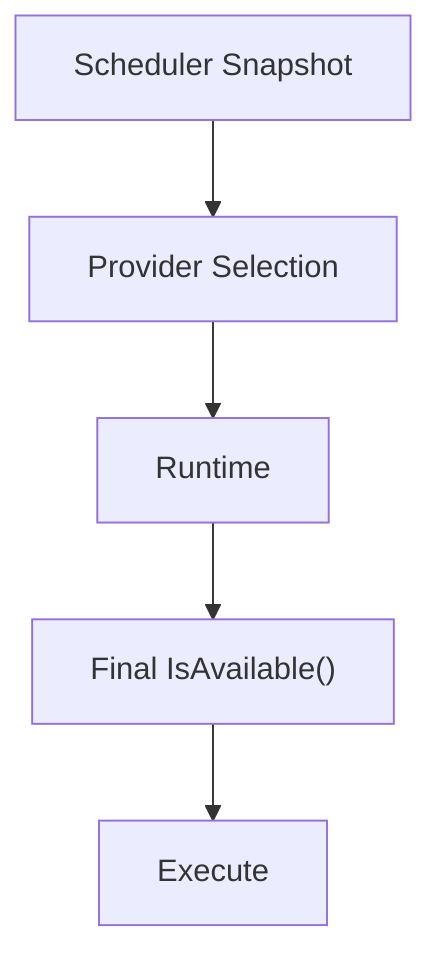
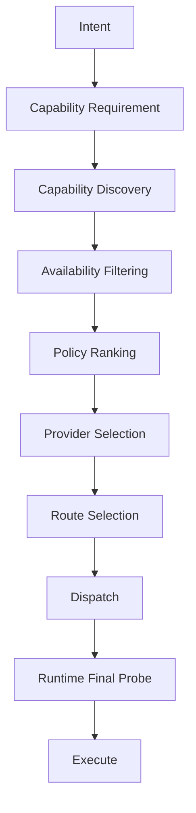

# HomeAgent Capability Availability & Runtime Lifecycle Specification

> 本文档是 [`dual-brain-runtime.md`](dual-brain-runtime.md) 的**补充规范**，重点解决 Capability 在分布式 Runtime 环境中的声明、可用性、调度、Heartbeat 与生命周期观测问题。

## 1. 核心结论

经过 GoPro / Android / iPhone 等实际 Case 验证，Capability 需要明确区分两个维度：

- **Capability Declaration**：这个 Runtime 理论上具备什么能力？
- **Capability Availability**：这个 Runtime 当前是否具备执行这个能力的条件？

二者不能合并。`DECLARED = true / AVAILABLE = false` 是一个完全合法、而且非常重要的状态。

## 2. 为什么不能把 Capability 和 Availability 绑定

iPhone 永远具备 `gopro.capture`，但它可能处于「家庭 LAN → GoPro 可达 → AVAILABLE」，也可能「人在外面 → GoPro 不可达 → UNAVAILABLE」。

如果直接把 Capability 从注册信息中删除，就丢失了一个重要事实：iPhone 仍然具备 GoPro 能力，只是当前环境无法使用。

**Capability Declaration 必须保持稳定，而 Availability 动态变化。**

## 3. Capability 的推荐模型

不改变现有 Capability 主结构（`Capability = Identity + Definition + Interface`）。`gopro.capture` 本身只负责描述「我能够完成 GoPro 拍照」。在此基础上，Runtime 增加 **Availability Probe**：`IsAvailable()`。

## 4. IsAvailable 是 Probe，不是 Execute

`IsAvailable()` 不是执行 Capability，而是以**极低成本判断 Capability 当前是否具备执行条件**。

| Capability | IsAvailable() 检查 |
|------------|-------------------|
| GoPro | GoPro Connectivity |
| USB Microphone | USB Device |
| Chromecast | Chromecast Reachability |

Availability Probe 必须：快、轻、无副作用、不执行真正任务、可以频繁调用。

## 5. Availability 必须进入调度层

过去 `Scheduler → Runtime → IsAvailable() → Execute` 只能解决「执行时发现不可用」，但会造成「错误 Provider 被选中 → 任务发送 → Runtime 才发现不可用 → 失败」。

Availability 应该提前进入：


## 6. 正确的两阶段 Availability Check

**第一阶段：Scheduling-time Probe / Snapshot。** Heartbeat 周期性获取 `gopro.capture=unavailable / camera.capture=available`，Planner / Scheduler 用这个状态进行 Provider Filtering。

**第二阶段：Execution-time Check。** 即使 Scheduler 看到 `available=true`，Runtime 真正执行之前仍然应该再次检查（T1 available=true → T2 GoPro Wi-Fi 断开 → T3 Task 到达 Runtime）。



## 7. Heartbeat 不只是 Liveness

Heartbeat 以前主要回答「Runtime 还活着吗」，现在扩展成：

```text
Heartbeat
├── Runtime Liveness
├── Connectivity State
└── Capability Availability Snapshot
```

例如 `android-001`：`alive=true`，`gopro.capture.available=true`，`camera.capture.available=true`，`microphone.input.available=false`。Heartbeat 是 Runtime 当前运行状态的轻量快照。

## 8. Heartbeat 与双 Registration

在 Local / Cloud 双 Brain 架构下，Runtime 同时有 Local Registration + Local Heartbeat、Cloud Registration + Cloud Heartbeat。两套 Heartbeat 必须独立，但两边描述的 Capability 来自同一个 Runtime。

## 9. Runtime 不需要修改 Capability 主结构

原有 Capability 不需要被改造成 Local/Cloud/Network/Brain 分支，只需要增加一个轻量接口 `IsAvailable()`。Runtime 在 Heartbeat 前：

```python
for capability in capabilities:
    availability = capability.IsAvailable()
# 然后 Heartbeat → Availability Snapshot → Brain
```

## 10. Capability 与 Network 继续保持解耦

Capability 不应该变成 `gopro.capture.local / gopro.capture.cloud`，而应该：

```text
Capability: gopro.capture
Provider: iPhone
Current Reachability: Local
Availability: Available
```

同一个 Capability 可以有多个 Provider。

## 11. GoPro Case

iPhone：`gopro.capture` Local=available / Cloud=unavailable；Android：`gopro.capture` Cloud=available。当用户从 iPhone 发起 `capture_photo` 且 iPhone 当前 Primary Brain=Cloud，则 iPhone → Cloud Brain → Capability Discovery → Availability Filtering → Android → GoPro Wi-Fi → GoPro。iPhone 自己虽然声明拥有 `gopro.capture`，但当前 `AVAILABLE=false`，所以不会被 Cloud Brain 选为 Provider。

## 12. Declaration 与 Availability 形成两个维度

|  | Available | Unavailable |
|--|-----------|-------------|
| Declared | 当前可调度 | 暂时不可调度 |
| Not Declared | 不具备能力 | 不具备能力 |

真正有调度意义的是 `Declared + Available`；`Declared + Unavailable` 表示 Capability 存在，但当前不能使用。

## 13. Heartbeat 由此产生 Runtime Capability Timeline

```text
10:00 Runtime registered
10:01 gopro.capture declared
10:01 gopro.capture available
10:08 GoPro Wi-Fi disconnected
10:08 gopro.capture unavailable
10:15 GoPro Wi-Fi reconnected
10:15 gopro.capture available
10:20 Runtime offline
```

这条 Timeline 完整描述 Runtime 在整个生命周期中拥有哪些能力，以及这些能力什么时候可用、什么时候不可用。

> **P0 实现：** Timeline 数据以**结构化日志**形式落盘（一行：`participant_id, domain, observed_at, online_status, capabilities_snapshot`），**不建表**。Timeline 查询 / 故障传播链分析引擎留待后续。

## 14. Capability Lifecycle

Capability 不只是一个静态列表，实际形成 `Declared → Available → Unavailable → Available → …` 的循环，最终 Runtime 拥有自己的 Capability Lifecycle History。

## 15. 对故障分析非常重要

例如 `android-001 alive=true, gopro.capture=unavailable, camera.capture=available`：Runtime 本身没问题，GoPro 能力出了问题。若随后 `android-001 alive=false`，则问题进一步扩散到 Runtime/Network 层。可观察 `Capability Failure → Connectivity Failure → Runtime Failure`，甚至形成故障传播链。

## 16. Availability 不应该被视为强一致状态

Heartbeat 中 `available=true` 只是「最近一次 Probe 的结果」，不是「未来一定可用」。Availability 必须允许存在时间窗口：`observed_at`，未来可增加 `expires_at` 或 `last_checked_at`。

## 17. Availability 是 Snapshot，不是 Source of Truth

真正执行时：Heartbeat Snapshot 用于调度，Runtime Execution 时 Final Probe 兜底。Heartbeat 解决「不要明知故犯地选错 Provider」；Execution-time Probe 解决「状态在调度之后发生变化」。

## 18. 三层职责最终形成清晰分工

| 层 | 回答 |
|----|------|
| Capability | 我能做什么？ |
| Availability | 我现在能不能做？ |
| Connectivity | 我现在通过什么路径能够做？ |
| Policy | 在多个可以做的人里面应该选择谁？ |

完整链路：



## 19. 永久原则

> **Brain 永远不主动 probe 设备**（包括 GoPro）。Availability 永远由 Runtime 在 heartbeat 前自检上报，Brain 只消费 snapshot，不下沉到设备层。这是永久原则，不是推迟。

理由：Probe 责任在离设备最近的 Runtime；Brain 只做调度过滤。Brain 主动 probe 会把设备层细节泄漏到控制面，违反 Control / Execution Plane 解耦。
