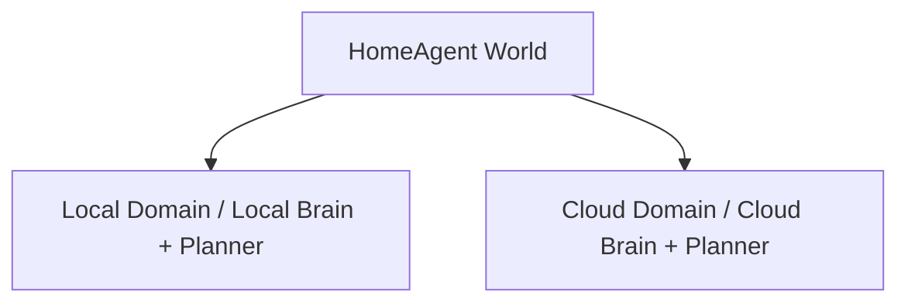
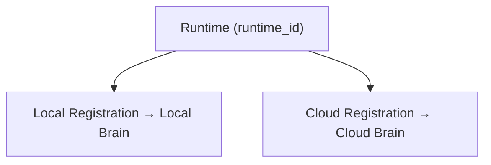
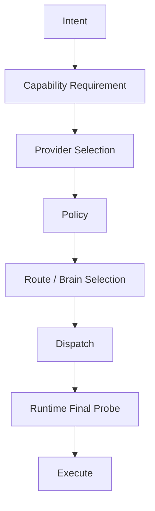
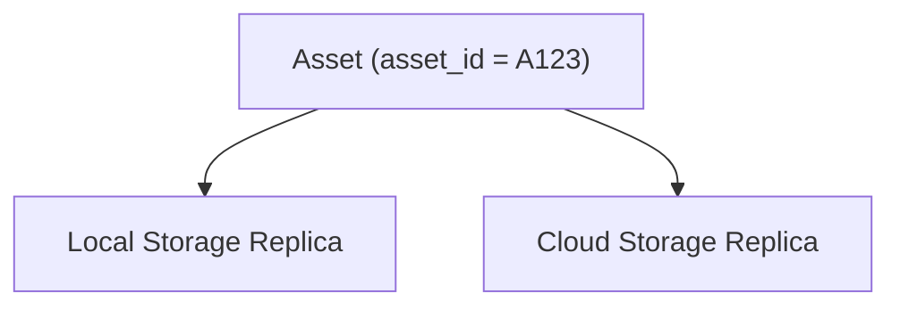

# HomeAgent：Local / Cloud 双 Brain、Runtime、Capability 与数据同步架构

> 本文档是 HomeAgent 当前阶段的**总体架构基线**（文档一）。补充规范见 [`capability-availability.md`](capability-availability.md)。Participant 模型见 [`../participant-model.md`](../participant-model.md)，Asset 契约见 [`../asset-contract.md`](../asset-contract.md)，DB schema 见 [`../db-schema.md`](../db-schema.md)。

## 1. 核心判断

把 Local Brain / Planner 和 Cloud Brain / Planner 分成两套以后，原来被单一大脑隐藏的分布式系统问题开始集中暴露。核心问题：

- Runtime 如何同时参与 Local / Cloud 两个 Brain？
- 两个 Brain 的 heartbeat 如何独立？
- Capability 是否应该绑定网络？
- GoPro 这种 Network Island 如何处理？
- Local / Cloud 两套 Asset / Image DB 是否需要同步？
- 人从家里走到外面以后，如何仍然访问同一个 HomeAgent 世界？

核心方向：把 **Identity、Capability、Connectivity、Brain、Registration、Policy、Data Storage 彻底解耦**。

## 2. 为什么暂时不进入多轮对话

单轮对话的主链路已经比较干净，但基础架构的 Edge Case 还没有完全收敛。现在进入多轮，Session 在 Local 还是 Cloud、iPhone 出门后 Session 是否继续、Turn 产生的 Asset 属于哪里、Runtime 中途断线等问题都会被放大。

**当前阶段目标不是继续加功能，而是：先把 Single-Turn Architecture 做到「Edge Case 可以被现有抽象吸收」，而不是不断增加特殊分支。**

## 3. Local Brain / Cloud Brain

存在两个 Control Plane：

它们不是两个完全独立的 HomeAgent，而是**同一个 HomeAgent World 在两个不同 Network / Discovery Domain 下的两个控制入口**。

| Brain | 主要负责 |
|-------|----------|
| Local Brain | 家庭 LAN 内调度、家庭设备发现、本地 Runtime、本地低延迟能力、Physical World 即时状态 |
| Cloud Brain | Mobile Runtime、Internet 可达 Runtime、家庭外访问、Global Discovery、跨 Network Domain 调度、Local World 与 Mobile World 的连接 |

## 4. Runtime Identity

Runtime 是 **Edge Identity**。例如 `runtime_id = android-001`，无论它现在在 LAN、在 Cellular、连 GoPro Wi-Fi、连 Local Brain、连 Cloud Brain，它始终是 `android-001`。

**原则：Runtime Identity 不与 Network 或 Brain 绑定。** Identity 由 Runtime 端生成并持久化，注册时上报；Brain 不签发（legacy `client_hint` 回绑保留过渡）。

## 5. Registration

同一个 Runtime 可以同时向多个 Brain 注册：

一个 Runtime 可以有多个 Registration。Registration 表示「我在这个 Domain 中如何参与」，而不是 Runtime 的第二个身份。

## 6. Heartbeat 必须属于 Registration

错误模型（heartbeat 挂在 Runtime 上随当前 Brain 跳）会导致 iPhone 在 Local/Cloud 间切换时状态乱跳。

正确模型：Heartbeat 是 **Registration / Connection State**，不是 Runtime Identity State。Local / Cloud heartbeat 必须独立，各自维护 `connection / latency / reachability`。

## 7. 不要求所有 Runtime 强制双注册

「双注册」是系统能力，不是硬编码规则。Runtime 通过 Policy 决定参加哪些 Domain：

| Runtime | Local | Cloud |
|---------|-------|-------|
| 家庭 Mac | ✓ | ✓ |
| 纯 LAN ESP32 | ✓ | ✗ |
| iPhone | conditional | ✓ |

## 8. Capability 与 Network 解耦

Runtime 拥有的 Capability（`gopro.capture` / `camera.capture` / `audio.input`）不属于 LAN、Cloud、某个 IP、某个 Brain，而属于 Runtime 本身。无论 Runtime 当前通过什么网络访问 GoPro，这个 Capability Identity 都不变。

## 9. Capability Exposure Policy

Runtime 自己决定在不同 Domain 下愿意暴露哪些 Capability。例如 iPhone：Local 暴露 `camera.capture / microphone / terminal.execute`，Cloud 只暴露 `camera.capture`，不暴露 `microphone / terminal.execute`。

这样不需要在 Cloud Planner 里硬编码 `if device == iPhone: microphone forbidden`，而是 iPhone Runtime 自己声明它的 Cloud Exposure Policy。

最终由 **System Policy / Participant Policy / Runtime Policy / Capability Policy** 共同决定 Capability 是否可以被调用。

## 10. Input / Output 统一成 Capability

Voice Input → Voice Output、iPhone Input → iPhone Output 都只是 Policy 选择；自身 Capability → Remote Capability 是 Provider Selection Policy。没有必要把 Input / Output 作为一套特殊的调度机制。

## 11. Capability Selection 默认优先级

1. 自身 Capability
2. 当前 Local Domain 的 Capability
3. 当前 Domain 内其他 Runtime
4. Remote / Cloud Capability
5. 更远的降级 Provider

受 `latency / trust / privacy / availability / device preference / participant preference / capability exposure / system policy` 影响。「自己优先」是默认策略，不是写死的调用关系。

## 12. Provider Selection 与 Route Selection 分离

Planner 不应同时解决「谁来做」和「怎么找到他」：

例如 iPhone → Cloud Brain → 找到 Android Runtime → Android 提供 `gopro.capture` → Android 内部访问 GoPro Wi-Fi。iPhone 完全不需要知道 GoPro Wi-Fi。

## 13. GoPro Case：Network Island

GoPro Wi-Fi 是 **Android Runtime 内部的 Network Island**，而不是 HomeAgent 的全局网络状态。Android Runtime 自己管理多个 Connectivity（Internet → Cloud Brain、Home LAN → Local Brain、GoPro Wi-Fi → GoPro）。

## 14. Physical Domain 与 Digital Domain

- **Physical Domain**（家庭 Camera/Mic/Speaker/Sensor/Mac/Android/Light/Door…）：有物理位置、相对固定、感知现实、作用现实、LAN 是天然连接环境。
- **Digital / Mobile Domain**（Cloud/iPhone/Mobile Runtime/Remote Services/Global Data）：没有固定物理位置、跟着用户移动、通过 Internet 连接。

Local Brain 更接近 Physical World，Cloud Brain 更接近 Digital / Mobile World，但不能简单等同 `LAN = Physical / Cloud = Virtual`。真正的 Physical AI 是「AI 是否形成了现实感知 → 推理 → 现实行动的闭环」。

## 15. 为什么双 Brain 是必要的

固定家庭设备 + 移动 iPhone/Android 一旦共存，双 Brain 就成为必要基础设施。Cloud Brain 实际承担 Physical Home World 与 Mobile World 之间的可达性中介。

## 16. Data Plane：Asset Identity 与 Storage Replica 解耦

Asset Identity 一份，Storage Replica 可以多份。家里访问 Local Replica，出门访问 Cloud Replica，两次都是 `asset_id = A123`，只是路径不同。

## 17. 统一 Data Replication Policy

不要针对 SQLite / Image / Asset / Event / Memory / Session 分别设计完全不同的同步模型。每个 Data Object 考虑 `Identity / Scope / Ownership / Replication Policy`：

| Data Object | scope | replication |
|--------------|-------|-------------|
| Heartbeat | DOMAIN_LOCAL | NONE |
| 家庭照片 | GLOBAL | LOCAL ↔ CLOUD |
| 临时视频 Buffer | LOCAL / EPHEMERAL | NONE |
| 长期用户数据 | GLOBAL | BIDIRECTIONAL |

统一的是 **Policy**，不是同步实现。Event → Event Replication、Asset Metadata → DB Replication、Image Binary → Object Replication。照片可以 `Local Capture → Local Commit → Sync Queue → Cloud Replica`，不需要 Local / Cloud 同时成功才算拍照成功。

## 18. 更大原则：Identity 一份，Domain State 多份

不复制 Identity（Runtime / Capability / Asset / Data Object Identity）；可以复制 Domain State（Registration / Heartbeat / Reachability / Replica / Exposure / Local State）。**Domain 可以有多个，但 Identity 尽量只有一个。**

## 19. Mac 当前过度承载的问题

Mac 同时承担 Local Bridge/Planner、Runtime Engine、Video Receiver、USB Audio Receiver、Image Server 等。Runtime Engine 重启会让整个节点的所有能力全部坍塌。未来应逐渐支持 Control / Runtime / Media / Audio / Asset Service 生命周期独立（P2）。

## 20. P0 工作边界

P0 固定对象模型并实现：双 Registration、Heartbeat 属于 Registration、Capability Exposure Policy、Declaration 与 Availability 解耦。P1（Connectivity 统一 / Data Replication / Asset Replica）、P2（Service Lifecycle 解耦）留待后续。

## 21. 单轮进入「稳定」的验收标准

不追求「没有 Bug」，而追求：**新 Edge Case 能否被已有抽象吸收，而不需要再写一个特殊 if。**

- GoPro：不要 `if GoPro: switch network`，而应自然落入 `Runtime Connectivity + Capability Provider + Route Selection`。
- 外面找不到照片：不要 `if outside: copy photo`，而应落入 `Asset Identity + Replica Policy + Replication Engine`。
- Local/Cloud heartbeat 混乱：不要 `fix heartbeat`，而应 `Registration-scoped Heartbeat`。

## 22. 进入多轮对话的前提

等 Local/Cloud Brain 稳定、Runtime Identity 稳定、Registration 稳定、Heartbeat 稳定、Capability Exposure 稳定、Connectivity 解耦、Provider/Route Selection 分离、Asset Identity/Replica 成立、Data Replication Policy 成立、主要 Edge Case 不再依赖特殊代码，再进入 Session / Multi-turn。这时 Session 应只是上层状态抽象，不再要求重构下层 Runtime/Brain/Data 架构。

## 23. 最终架构原则

1. Identity 与 Domain 解耦：Runtime / Asset / Data Object 的 Identity 不因 Local/Cloud 改变。
2. Runtime 与 Network 解耦：一个 Runtime 可以同时拥有多个 Connectivity。
3. Runtime 与 Brain 解耦：一个 Runtime 可以同时向多个 Brain Registration。
4. Heartbeat 属于 Registration：Local / Cloud heartbeat 必须独立。
5. Capability 与 Network 解耦：Capability 属于 Runtime，而不是某个网络。
6. Capability Exposure 由 Policy 决定：Runtime 自己决定在不同 Domain 暴露什么。
7. Provider Selection 与 Route Selection 分离：先决定「谁做」，再决定「通过谁找到他」。
8. Asset Identity 与 Storage Replica 解耦：一个 Asset 可以拥有多个 Storage Replica。
9. Data Replication Policy 统一：SQLite / Asset / Event / Memory 遵循统一的 Scope / Ownership / Replication 模型。
10. Local / Cloud 是两个 Domain，不是两个世界：两个 Brain 看到的是同一个 HomeAgent World 的不同视图。
11. 先收敛单轮，再进入多轮：Edge Case 能被现有抽象吸收，是进入 Multi-turn 的前提。

补充原则（来自 [`capability-availability.md`](capability-availability.md)）：

12. Capability Declaration 与 Availability 必须解耦：`DECLARED=true / AVAILABLE=false` 是合法且重要的状态。
13. Availability 是轻量 Probe，而不是 Capability Execution；**Brain 永远不主动 probe 设备**，Availability 由 Runtime 自检上报。
14. Heartbeat 同时承担 Runtime Liveness 与 Capability Availability Snapshot。
15. Availability Snapshot 用于调度前 Provider Filtering；Runtime 执行前必须再次确认 Availability。
16. Capability 不可因为暂时不可用而从 Declaration 中删除。
17. Control Plane / Execution Plane / Data Plane 相互解耦。
18. Asset Identity 与 Storage Replica 解耦。
19. Local / Cloud 是同一个 HomeAgent World 的不同 Control Domain，而不是两个独立系统。
20. Edge Case 应优先通过抽象和 Policy 吸收，而不是增加特殊逻辑。

## 24. 一句话总结

HomeAgent 正在从「一个 Brain 调度一堆设备」演进成「一个统一 Identity 的分布式 Runtime World，由 Local / Cloud 两个 Control Domain 协同管理，通过 Policy 管理 Capability、Connectivity，并通过 Replication 管理跨 Domain 数据」。
