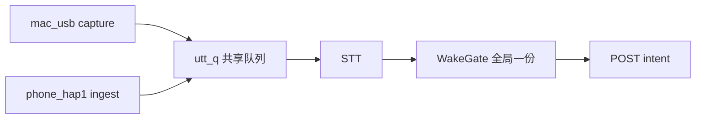
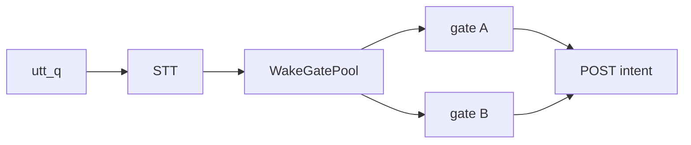

# 多路 voice.stream：按说话人隔离唤醒窗

> 状态：**已落地**（`MAC_VOICE_WAKE_SCOPE=participant` 默认）  
> 背景：USB 麦与 Home Mic（`phone_hap1`）已合流进同一 `mac_voice` 进程；身份按 `participant_id` 归因，但曾共用 **一份** WakeGate。  
> 问题：A 说完「面条面条」后，B 在 ~5s 窗内不说唤醒词也能下发指令。

相关实现：[`mac/src/mac_voice/listen.py`](../../mac/src/mac_voice/listen.py)、[`mac/src/mac_voice/wake.py`](../../mac/src/mac_voice/wake.py)（`WakeGatePool`）、[`plugins/voice-stream/capability.md`](../../plugins/voice-stream/capability.md)。

---

## 1. 目标与非目标

### 目标

1. **唤醒态按 Input Source（说话人 Runtime）隔离**：A 唤醒不影响 B；B 必须自己说唤醒词（或同路同 participant 的后续指令）。
2. **意图归因不变**：过门后的 intent 仍带该路的 `input_participant_id` + `ingress`；`voice_host` 仍是 Mac。
3. **改动面尽量只在 `mac_voice`**：Brain / iOS / HAP1 协议不改（除非讨论后要加 session 字段）。
4. **可测**：用两路伪 utterance（不同 `input_participant_id`）单测即可钉死「不蹭窗」。

### 非目标（本期不做）

- 不做多 Brain / 多 Mac 的跨主机会话同步。
- 不改唤醒词文案、重复次数、5s 窗长度的产品默认值（隔离后仍用同一套参数）。
- 不把「一路唤醒后全家都能说」做成可配置模式（若以后要，另开开关；默认隔离）。
- 不解决两人同时大声抢麦导致的 STT 串音物理问题（隔离的是门状态，不是声学）。

---

## 2. 现状（为何会蹭窗）

- 两路 PCM 各自切句，打上不同 `input_participant_id` / `ingress`。
- 听写后全部 `gate.feed(...)` **同一个** `WakeGate`。
- 状态机 `idle → partial → acking → listening` 与 `command_window_ms` 是进程级共享的。

因此：**身份分路，会话不分路。**

---

## 3. 推荐方案：按 `input_participant_id` 的 WakeGate 池

### 3.1 核心规则

| 键 | 含义 |
|----|------|
| 主键 | `input_participant_id`（非空） |
| 回退键 | `ingress`（如 `mac_usb` / `phone_hap1`），仅当 participant 尚未登记时 |
| 禁止 | 用全局 `"_shared"` 当默认键（那会退回今天的行为） |

对每条 utterance：

1. `key = participant_id or ingress or "unknown"`
2. `gate = pool.get_or_create(key)`（参数与现配置一致）
3. `command = gate.feed(...)`；ack / expire 只碰 **该 key** 的 gate
4. 过门才 `handle_transcript(..., input_participant_id=...)`

### 3.2 生命周期

- **创建**：第一次见到该 key 时建 gate。
- **回收**：gate 回到 `idle` 且超过 TTL（建议 10–30 min 无 feed）可删，防泄漏；进程内几十路足够。
- **expire**：主循环空转时，对 **池内所有** gate 调 `expire_if_needed`（hold 逻辑可继续用全局 capture activity，或按 key 记最近能量——见开放问题）。

### 3.3 「又咋了」应答

现状：唤醒成功后本机 `say`「又咋了」，再 `arm_after_ack`。

隔离后建议：

- **应答仍全局喇叭播一次**（客厅就一个喇叭）：谁唤醒谁触发 `handle_wake`；短时间内第二路再唤醒，可合并/丢弃重复播报（debounce ~1.5s），避免「又咋了又咋了」。
- **开窗只给触发那一路**：`arm_after_ack` / `_arm_command_window` 只作用在该 key 的 gate。
- TTS 回声：仍靠现有 echo 过滤；回声可能进 USB 或 Home Mic。回声 utterance 应打上实际录入路的 participant——若被另一路麦录到，可能误喂另一 gate。缓解：
  - 继续用 `looks_like_ack_echo` 全路丢弃纯应答；
  - 可选：ack 播报期间 **所有** gate 短暂忽略「纯应答」类文本（已有），不必全局开窗。

### 3.4 同设备多入口

同一 iPhone 的 Legacy「拾音」与将来其它 App，只要 HAP1 hello 带 **同一** `participant_id`，共享同一 gate——这是正确的（同一 Runtime）。

USB 麦始终是 Mac 的 `participant_id`（`ingress=mac_usb`）。

### 3.5 always_on

`MAC_VOICE_LISTEN_MODE=always_on`：无 gate，行为不变（每路 STT 都可发 intent）。隔离只针对 `wake_word`。

---

## 4. 备选（讨论用，不推荐作默认）

| 方案 | 做法 | 缺点 |
|------|------|------|
| A. 按 ingress 隔离 | 只分 `mac_usb` vs `phone_hap1` | 两台手机同走 HAP1 仍会互蹭 |
| B. 按 TCP 连接隔离 | HAP1 每连接一个 gate | 重连丢窗；同一人断线重连要重新唤醒（可接受），但 USB 无连接概念，仍要并入 participant |
| C. Brain 侧会话 | intent 带 session，Brain 拒「未唤醒」 | 唤醒态不在 STT 前，延迟大；且本地「又咋了」与 Brain 双源真相 |

**推荐仍是 3：按 `input_participant_id`（回退 ingress）。** A/B 可作过渡，但不如 participant 键干净。

---

## 5. 行为对照（验收故事）

| # | 场景 | 期望 |
|---|------|------|
| 1 | USB 说「面条面条」→「又咋了」→ USB 5s 内说「开灯」 | 过门，intent 归因 Mac |
| 2 | USB 唤醒后，Home Mic 5s 内直接说「开灯」（无唤醒） | **丢弃**，不过门 |
| 3 | Home Mic 自己说「面条面条」后再说「开灯」 | 过门，归因该 iPhone participant |
| 4 | 两路几乎同时唤醒 | 两路各自开窗；喇叭「又咋了」debounce 只播一次或两次很近（产品可接受） |
| 5 | A 窗过期后 B 未唤醒说话 | 两路都丢 |
| 6 | participant 空（旧客户端） | 退回按 `ingress` 隔离；日志打 warn |

---

## 6. 实现草图（通过后再写代码）

1. 新增 `WakeGatePool`（或 `listen.py` 内小类）：`get(key) -> WakeGate`，`expire_all(hold=...)`。
2. `_run_live_locked`：删掉单个 `gate = WakeGate(...)`；按 utterance 取 gate；ack task 带上 key，只 `arm` 该 gate。
3. 单测：不启真实 STT，直接对 pool feed 两条不同 pid 的假转写，断言 B 不能蹭 A 的 listening。
4. 文档：`plugins/voice-stream/capability.md` 补「唤醒态按 Input Source 隔离」。
5. 不改 HAP1 / iOS / Brain API。

预估：**小改**（主要 `listen.py` + `wake` 旁池 + 测），无协议变更。

---

## 7. 开放问题（讨论点）

1. **空 participant**：严格拒绝过门 vs 回退 `ingress`？（建议回退 + warn）
2. **hold / expire**：空转 expire 时，`activity.should_hold` 是否全局？若 USB 在说话，是否应阻止 **Home Mic gate** 过期？建议：**hold 只作用于「正在出声的那条 key」**；其它 key 照常到期。
3. **双路同听一声**：物理串音导致 B 的 STT 也听到 A 的「面条面条」——B 可能被意外唤醒。是否接受？若不能接受，要能量门/定向麦，超出本方案。
4. **是否要产品开关** `MAC_VOICE_WAKE_SCOPE=participant|global` 方便回滚？建议要，默认 `participant`。
5. **ack debounce**：单播 vs 允许双播？

---

## 8. 建议结论（供拍板）

- **默认做：按 `input_participant_id` 的 WakeGate 池 + `MAC_VOICE_WAKE_SCOPE` 可回滚。**
- 应答喇叭共享、开窗不共享。
- 协议与端上不动；先测后合。

拍板后按 §6 开工；本节讨论未定前 **不改代码**。

---

## 9. 落地记录

- 已实现 `WakeGatePool` + `MAC_VOICE_WAKE_SCOPE`（默认 `participant`，可 `global` 回滚）。
- 单测：`mac/tests/test_voice_wake.py` → `WakeGatePoolTests`（含「Home Mic 不蹭 USB 窗」）。
- 协议 / iOS / Brain **未改**。重启 `mac_voice`（或 Mac Edge 监督）后生效。
