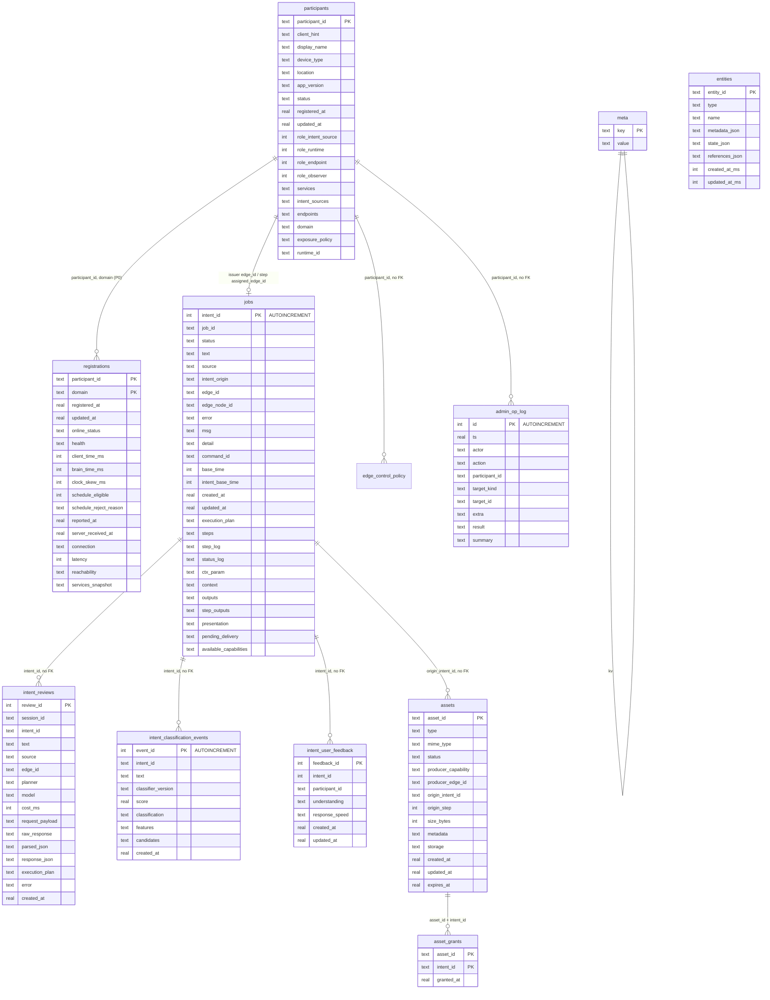

# Brain SQLite schema

状态：**已批准**。本文是现行 DBA 合同，只描述当前库。实现：`server/sql/*.sql` + `server/db.py`。引擎 SQLite 3；表名与列名可平移到 Postgres。

范围：intent 物流、Participant 注册与心跳、意图复盘、意图复杂度分类事件、Asset 目录、管理员调度策略 `edge_control_policy`、管理员操作日志 `admin_op_log`、**Entity Registry（一期 Device）**、**Runtime Identity / Registration / Heartbeat（P0 双 Brain）**。  
不在本期：Mac Edge `local_ledger.json` / `edge_id.json`、Android SharedPreferences、iOS UserDefaults、`heartbeat_history` 表（P0 用结构化日志，分析引擎待后续）。

wire 名 `edge_id` / 步上 `assigned_edge_id` 仍用，值等于 `participant_id`。`location` 的入站别名是 `room`。整单不再有 `jobs.assigned_edge_id` 或 `scheduler_node`。

**P0 双 Brain 约定（见 [`architecture/dual-brain-runtime.md`](architecture/dual-brain-runtime.md) 与 [`architecture/capability-availability.md`](architecture/capability-availability.md)）：** `participant_id` 即 Runtime Identity，由 Runtime 端生成并持久化、注册时上报，Brain 不再签发（legacy `client_hint` 回绑保留过渡）。每个 Brain 进程即一个 domain（`lan`/`cloud`，由 `instance_intent_origin()` 写入）。Heartbeat 属于 Registration，状态列落在 `registrations` 表（键 `(participant_id, domain)`）。`participants.services` 是稳定的 Capability Declaration；Availability 进入 heartbeat 的 `services[].capabilities[].available` + `observed_at`。`participants.exposure_policy` 是 per-domain Capability Exposure Policy。`DECLARED=true / AVAILABLE=false` 是合法状态：不进 `capability_edge_mapping`，但 Declaration 不删。

库文件：`server/data/brain.sqlite3`（环境变量 `BRAIN_DB_PATH`）。  
运行参数：`journal_mode=WAL`，`foreign_keys=ON`，`busy_timeout=5000`，`synchronous=NORMAL`。

---

## 1. 设计原则

1. **标量进列，形状会变的数组/对象各自一列 JSON。** 禁止再套一层整份 job 的 JSON 列。`execution_plan` / `steps` / `step_log` 不拆行表。
2. **拉取看 `jobs.status`，不另建队列表。** 非终态（以及 `succeeded` 且仍有 `pending_delivery.edge_id`）对 Edge 可见；终态行留给 `intent_detail`，不因 GET/pop 删除。
3. **发出与规划都写 `jobs`。** 包括 `POST /api/v1/devices/living-room/intents`。
4. **一套 intent 序号。** `jobs.intent_id` 为 INTEGER PRIMARY KEY AUTOINCREMENT；`meta.next_intent_id` 仍用于应用层预分配并与 `sqlite_sequence` 对齐。
5. **时间单位照 wire：** `base_time` / `client_time_ms` / `brain_time_ms` 为 Unix **毫秒**整数；`created_at` / `updated_at` / `registered_at` 为 Unix **秒**浮点。
6. Plugin 只看本步已 resolve 的入参；本 schema 不引入 step 间读取。
7. **不加二级索引。** 只保留 PRIMARY KEY。
8. **复盘与物流分表。** 一场会话多轮、每轮都可能再调 LLM。`jobs` 只跟当前执行；`intent_reviews` 按次追加原文和解析，用 `session_id` 串起整场对话。
9. **Asset 身份是 `asset_id`。** 步间只传 `asset_ref`（`{asset_id, type, mime_type?}`）。禁止 `photo_url` / `image_url` 双写。库不存 bytes，不把 path / 永久 URL 当 identity。存储与授权归 Runtime Asset Manager。

---

## 2. 关系



`schema_migrations` 只给 migrator 用，不参与业务。

---

## 3. 表

### 3.1 `schema_migrations`

| 列 | 类型 | 空 | 说明 |
|----|------|----|------|
| `version` | INTEGER PK | 否 | 对应 `server/sql/NNN_*.sql` 文件名前缀 |
| `applied_at` | TEXT | 否 | UTC `datetime('now')` |

### 3.2 `meta`

| 列 | 类型 | 空 | 说明 |
|----|------|----|------|
| `key` | TEXT PK | 否 | 配置键 |
| `value` | TEXT | 否 | 字符串存，调用方解析类型 |

| key | 初值 | 含义 |
|-----|------|------|
| `next_intent_id` | `'1'` | 下一个可分配的 intent 序号（正整数）。`next` 取出后写 `value = value+1`。显式写入更大 id 时，`value = max(value, seen+1)`。 |

分配必须在 `BEGIN IMMEDIATE` 内完成。

### 3.3 `jobs`

`GET /api/v1/intent_detail` 与 status/step 上报的权威行。标量各一列；数组/对象各一列 JSON TEXT。

| 列 | 类型 | 空 | 说明 |
|----|------|----|------|
| `intent_id` | INTEGER PK AUTOINCREMENT | 否 | 与 wire `intent_id` 同值（整数）；INSERT 省略时 SQLite 自增分配 |
| `job_id` | TEXT | 是 | 等于 `str(intent_id)` |
| `status` | TEXT | 否 | 权威物流状态（读回时 `intent_status` 与此同值） |
| `text` | TEXT | 是 | 用户原话 |
| `source` | TEXT | 是 | `text` \| `voice` |
| `intent_origin` | TEXT | 是 | `lan` \| `cloud`：受理该 intent 的 Brain 控制面（本机 LAN 实例或云实例），不是用户所在地。缺省/历史行为 NULL。迁移：`server/sql/019_jobs_intent_origin.sql` |
| `edge_id` | TEXT | 是 | **发出端** Participant id |
| `edge_node_id` | TEXT | 是 | 最近一次上报的执行节点 |
| `error` | TEXT | 是 | 失败原因 |
| `msg` | TEXT | 是 | 与 `error` 同源的可读失败 |
| `detail` | TEXT | 是 | 最近一次状态说明 |
| `command_id` | TEXT | 是 | 入队行 id |
| `base_time` | INTEGER | 是 | Unix **毫秒** |
| `intent_base_time` | INTEGER | 是 | 调度原点，Unix 毫秒 |
| `created_at` | REAL | 否 | Unix 秒 |
| `updated_at` | REAL | 否 | Unix 秒 |
| `execution_plan` | TEXT | 否 | JSON array，见 §4.4；默认 `[]` |
| `steps` | TEXT | 是 | JSON array，见 §4.5 |
| `step_log` | TEXT | 是 | JSON array，见 §4.6 |
| `status_log` | TEXT | 是 | JSON array |
| `ctx_param` | TEXT | 是 | JSON object |
| `context` | TEXT | 是 | JSON object；应与 `ctx_param` 同内容 |
| `outputs` | TEXT | 是 | JSON object |
| `step_outputs` | TEXT | 是 | JSON object |
| `presentation` | TEXT | 是 | JSON object；公开形状用 `asset_ref`，禁止 `image_url` / `photo_url` |
| `pending_delivery` | TEXT | 是 | JSON object |
| `available_capabilities` | TEXT | 是 | JSON array：规划当时 planner 看到的 Available Capabilities 目录（已滤 `available=false`）。历史行 NULL。迁移：`server/sql/024_jobs_available_capabilities.sql` |

写入：`INSERT … ON CONFLICT(intent_id) DO UPDATE`（除 `created_at` 外整行替换列）。应用层 `put_job` / `get_job` 收发明文字典。未声明的键不落库。

空 `execution_plan` 不得停留在 `intent_parsed`：必须 `failed`，且 `msg`/`error` 为 `execution_plan 为空，无法调度`。

Edge 拉取（`GET …/intents?edge_id=`）读本表。可见条件：`status` 不是 `succeeded` / `failed` / `intent_waiting`，或 `succeeded` 且 `pending_delivery.edge_id` 非空。GET 无论是否 `peek` 都不删行。应用层 `list_queue` / `upsert_queue` 内部走本表。

### 3.4 `participants`

核心抽象是 **Participant + Role + Contract**（见 `docs/participant-model.md`），不是设备类型。`device_type` 只是 Identity，不决定能做什么。

同一 Participant 可同时具备最多四种正交 Role（列值为 0/1）：`intent_source` / `runtime` / `endpoint` / `observer`。此处 Observer 是产品事件消费者（CLI / Dashboard），不是 Cursor `@coordinator`。

P0 双 Brain 后，`participants` 只承载 **Identity + Declaration + Exposure Policy**；**心跳状态迁到 `registrations`**（§3.4a）。`services` 是稳定的 Capability Declaration；Availability 不落本表（进 `registrations.services_snapshot`）。

| 列 | 类型 | 空 | 说明 |
|----|------|----|------|
| `participant_id` | TEXT PK | 否 | **Runtime Identity**，由 Runtime 端生成并持久化、注册时上报。wire 仍可叫 `edge_id`，值相同。legacy `client_hint` 回绑保留过渡 |
| `client_hint` | TEXT | 是 | 客户端建议 id（legacy 回绑用） |
| `display_name` | TEXT | 是 | |
| `device_type` | TEXT | 是 | Identity，不是 Role |
| `location` | TEXT | 是 | 物理位置，默认 `living-room`。wire 仍可叫 `room`，值相同 |
| `app_version` | TEXT | 是 | |
| `status` | TEXT | 否 | 一期 `approved`（auto-approve） |
| `registered_at` | REAL | 否 | Unix 秒 |
| `updated_at` | REAL | 否 | Unix 秒 |
| `role_intent_source` | INTEGER | 否 | 0/1；有 `intent_sources` 则置 1 |
| `role_runtime` | INTEGER | 否 | 0/1；有 `services` 则置 1 |
| `role_endpoint` | INTEGER | 否 | 0/1；有 `endpoints` 则置 1 |
| `role_observer` | INTEGER | 否 | 0/1；靠入站 `roles` / `role_observer` |
| `services` | TEXT | 是 | Runtime 契约：JSON array，见 §4.7。**Capability Declaration（稳定）** |
| `intent_sources` | TEXT | 是 | Intent Source 契约：JSON array，见 §4.2 |
| `endpoints` | TEXT | 是 | Endpoint 契约：JSON array，见 §4.2 |
| `domain` | TEXT | 是 | 本 Brain 的 domain：`lan` \| `cloud`，注册时由 `instance_intent_origin()` 写入。迁移：`server/sql/022_runtime_identity.sql` |
| `exposure_policy` | TEXT | 是 | JSON `{lan:[cap...], cloud:[cap...]}`；`can_participate` 第 4 条检查用。无 policy 默认全开。迁移：`022` |
| `runtime_id` | TEXT | 是 | 冗余 = `participant_id`，供未来跨 Brain 联邦查询；本期等于 `participant_id`。迁移：`022` |

> 心跳列（`online_status` / `health` / `client_time_ms` / `brain_time_ms` / `clock_skew_ms` / `schedule_eligible` / `schedule_reject_reason` / `reported_at` / `server_received_at`）**已迁出到 `registrations`**（§3.4a，迁移 `server/sql/023_registrations.sql`），`participants` 不再保留。迁移前旧列备份到 `participants_heartbeat_backup`。

`participant_id` 在 Brain 重启后必须稳定：已登记的 `client_hint` 不得重新签发成新 id。P0 后 Identity 由 Runtime 自持，跨 Brain 同一 Runtime 用同一个 id。

写入：先注册后心跳。`put_registration` 写 `participants`（Identity + Declaration + Exposure Policy）；`put_heartbeat` 写 `registrations`，要求该 `(participant_id, domain)` 行已存在。未声明的键不落库。

### 3.4a `registrations`

Per-domain Registration 与 Heartbeat 状态。键 `(participant_id, domain)`。一个 Brain 进程只存本 domain 的行；同一 Runtime 的「多 Registration」物理上分布在 Local/Cloud 两个 Brain DB。

| 列 | 类型 | 空 | 说明 |
|----|------|----|------|
| `participant_id` | TEXT | 否 | PK 之一；等于 `participants.participant_id`，无外键 |
| `domain` | TEXT | 否 | PK 之一；`lan` \| `cloud`，等于该 Brain 的 `instance_intent_origin()` |
| `registered_at` | REAL | 否 | Unix 秒 |
| `updated_at` | REAL | 否 | Unix 秒 |
| `online_status` | TEXT | 是 | `online` \| `offline`；无心跳为 NULL |
| `health` | TEXT | 是 | JSON object `{status, summary, details}` |
| `client_time_ms` | INTEGER | 是 | Edge 时钟，Unix 毫秒 |
| `brain_time_ms` | INTEGER | 是 | Brain 收到时，Unix 毫秒 |
| `clock_skew_ms` | INTEGER | 是 | 绝对值差 |
| `schedule_eligible` | INTEGER | 是 | 0/1；偏差 > 5 分钟则为 0 |
| `schedule_reject_reason` | TEXT | 是 | 仅不合格时 |
| `reported_at` | REAL | 是 | Unix 秒 |
| `server_received_at` | REAL | 是 | Unix 秒 |
| `connection` | TEXT | 是 | 预留：连接方式描述 |
| `latency` | INTEGER | 是 | 预留：毫秒 |
| `reachability` | TEXT | 是 | 预留：`lan` \| `cloud` \| `island` |
| `services_snapshot` | TEXT | 是 | JSON array：本次 heartbeat 的 `services[]`，`capabilities[]` 含 `available` + `observed_at`（Availability Snapshot） |

在线 TTL **不落库**：读取时若 `online_status=online` 且 `now - server_received_at > 30s`，响应里标 `offline`。

写入：`INSERT … ON CONFLICT(participant_id, domain) DO UPDATE`。`put_heartbeat` 落本表；同时落一行结构化日志（`participant_id, domain, observed_at, online_status, capabilities_snapshot`）供 Capability Lifecycle Timeline（P0 不建 `heartbeat_history` 表，分析引擎待后续）。

### 3.5 `intent_reviews`

复盘表。一场 **会话（session）** 会有多轮对话，每轮都可能再调 LLM，所以不能把「原文 + 解析」塞进 `jobs` 一行里盖掉。本表 **只追加**：同一 `session_id` 下多轮、同一 `intent_id` 上多次介入（重试 / 改口 / 换 planner）各占一行。

不是物流、不给 Edge 拉取。不外键到 `jobs`。为换模型横向回放，**存完整 Ark HTTP body**（含 system + user messages）。**不存密钥**（Authorization / API key 不落库）。未声明的键不落库。迁移：`server/sql/008_intent_reviews.sql`、`009_intent_reviews_session.sql`、`021_intent_reviews_request_payload.sql`。

| 列 | 类型 | 空 | 说明 |
|----|------|----|------|
| `review_id` | INTEGER PK | 否 | 自增；一次 LLM 介入一行 |
| `session_id` | TEXT | 是 | 会话。按它把多轮对话串起来复盘 |
| `intent_id` | TEXT | 否 | 该轮对应的 `jobs.intent_id` |
| `text` | TEXT | 是 | 这一轮用户原话 |
| `source` | TEXT | 是 | `text` \| `voice` |
| `edge_id` | TEXT | 是 | 发出端 Participant id |
| `planner` | TEXT | 是 | `ark` \| `heuristic` |
| `model` | TEXT | 是 | 模型 id |
| `cost_ms` | INTEGER | 是 | 这次 Ark HTTP 墙钟耗时，毫秒（缓存命中为 0；失败也写到失败时刻） |
| `request_payload` | TEXT | 是 | JSON object，实际发给 Ark 的 HTTP body（`model` / `messages` / `temperature` / `max_tokens` / `response_format` / `extra_body` 等）。禁止含 Authorization |
| `raw_response` | TEXT | 是 | 这一次助手原文（`choices[0].message.content`，字符串，禁止双重 JSON 编码） |
| `parsed_json` | TEXT | 是 | JSON object，这一次结构化输出 |
| `response_json` | TEXT | 是 | JSON object，Ark 完整响应（usage / reasoning_content / HTTP 错误体）。缓存命中可空 |
| `execution_plan` | TEXT | 是 | JSON array，这一次抽出的 plan 快照 |
| `error` | TEXT | 是 | 这一次调用或拆包失败 |
| `created_at` | REAL | 否 | Unix 秒 |

`jobs` 只跟当前这一单的执行；复盘按 `session_id` 再按 `review_id` 看整场对话里每一次 LLM。

### 3.5a `intent_user_feedback`

Intent Source 用户对单条 intent 的主观评价，与物流 / 复盘分开存。

| 列 | 类型 | 空 | 说明 |
|----|------|----|------|
| `feedback_id` | INTEGER PK | 否 | 自增 |
| `intent_id` | INTEGER | 否 | `jobs.intent_id` |
| `participant_id` | TEXT | 否 | 提交评价的发出端 |
| `understanding` | TEXT | 否 | `accurate` \| `inaccurate`（意图理解是否准确） |
| `response_speed` | TEXT | 否 | `fast` \| `normal` \| `slow` |
| `created_at` | REAL | 否 | Unix 秒，首次提交 |
| `updated_at` | REAL | 否 | Unix 秒，末次改评 |

`UNIQUE(intent_id, participant_id)`，同一人对同一 intent 可改评（upsert）。不外键到 `jobs`。迁移：`server/sql/015_intent_user_feedback.sql`。API：`POST/GET /api/v1/intent_feedback`。

### 3.5b `intent_classification_events`

Intent Complexity Classifier V1 的观察事件。Planner 之前对用户原话做规则打分，**只追加、不改物流、不改 `execution_plan`**。Dry-run `POST /api/v1/intent_classify` 可以没有 `intent_id`。不外键到 `jobs`。无二级索引。迁移：`server/sql/018_intent_classification_events.sql`。

| 列 | 类型 | 空 | 说明 |
|----|------|----|------|
| `event_id` | INTEGER PK AUTOINCREMENT | 否 | 一次分类一行 |
| `intent_id` | TEXT | 是 | 对应 `jobs.intent_id`；dry-run 可空 |
| `text` | TEXT | 是 | 用户原话 |
| `classifier_version` | TEXT | 是 | 如 `v1-rule` |
| `score` | REAL | 是 | 加权分 |
| `classification` | TEXT | 是 | `SIMPLE` \| `MEDIUM` \| `COMPLEX` |
| `features` | TEXT | 是 | JSON object，特征计数 |
| `candidates` | TEXT | 是 | JSON array，命中的 `capability_id` |
| `created_at` | REAL | 否 | Unix 秒 |

`features` / `candidates` 禁止双重 JSON 编码。未声明的键不落库。

### 3.5c `global_events`

家庭级全局事件流。Mode 切换是 `kind='mode'` 的一种；后续可追加 scene / preference 等，不改表结构。append-only；状态由事件推导（如 `resolve_active_mode()`）。不外键。无二级索引。迁移：`server/sql/025_global_events.sql`。

| 列 | 类型 | 空 | 说明 |
|----|------|----|------|
| `event_id` | INTEGER PK AUTOINCREMENT | 否 | 自增 |
| `kind` | TEXT | 否 | 如 `mode` |
| `action` | TEXT | 否 | 如 `activate` / `deactivate` |
| `subject` | TEXT | 是 | kind=mode 时为 `reading` / `game` 等 |
| `payload` | TEXT | 是 | JSON 扩展 |
| `edge_id` | TEXT | 是 | 触发来源 participant_id |
| `intent_id` | TEXT | 是 | 关联 intent |
| `created_at` | REAL | 否 | Unix 秒 |

API：`GET /api/v1/mode`（读当前 mode + 最近 mode 事件）。写事件经 Shortcut 拦截链（intent POST），无单独写 HTTP。

### 3.6 `assets`

Asset 目录。身份是 **`asset_id`**（`asset_` + ULID）。bytes 不进本表。步间只传 `asset_ref`。禁止 `photo_url` / `image_url` / path / 永久 URL 落库（入站 `metadata` 与 `storage` 里这些键会丢掉）。

`storage` 仅给 Runtime Asset Manager（`{backend, key, edge_id}`）。Representation 按次生成，不作为 identity 存。`intent_detail` 对外只暴露 `asset_ref`，不暴露 `storage`。

不外键到 `jobs`。未声明的键不落库。删除是把 `status` 写成 `deleted`。不迁旧 `photo_url` 数据。

| 列 | 类型 | 空 | 说明 |
|----|------|----|------|
| `asset_id` | TEXT PK | 否 | `asset_` + ULID |
| `type` | TEXT | 否 | §5.5 |
| `mime_type` | TEXT | 是 | 如 `image/jpeg` |
| `status` | TEXT | 否 | §5.6；默认 `available` |
| `producer_capability` | TEXT | 是 | 如 `camera.capture` |
| `producer_edge_id` | TEXT | 是 | 生产节点 `participant_id` |
| `origin_intent_id` | TEXT | 是 | 创建时所属 intent |
| `origin_step` | INTEGER | 是 | 创建时所属 step |
| `size_bytes` | INTEGER | 是 | 字节数 |
| `metadata` | TEXT | 是 | JSON object，公开描述（宽高等） |
| `storage` | TEXT | 是 | JSON StorageLocator，仅 Asset Manager |
| `created_at` | REAL | 否 | Unix 秒 |
| `updated_at` | REAL | 否 | Unix 秒 |
| `expires_at` | REAL | 是 | Unix 秒 |

写入：`INSERT … ON CONFLICT(asset_id) DO UPDATE`（不改 `created_at`）。有 `origin_intent_id` 时自动 grant 该 intent。

### 3.7 `asset_grants`

MVP：同一 intent 内才能 resolve。拥有 `asset_id` ≠ 有权读内容。复合主键 `(asset_id, intent_id)`。Producer 注册时写入。跨 intent 引用后做。

| 列 | 类型 | 空 | 说明 |
|----|------|----|------|
| `asset_id` | TEXT | 否 | PK 之一 |
| `intent_id` | TEXT | 否 | PK 之一 |
| `granted_at` | REAL | 否 | Unix 秒 |

临时 signed URL / token 不落本表。

### 3.8 `edge_control_policy`

管理员对节点 Role / Runtime capability 的调度开关。**不写 `participants` 心跳或注册列**。无行 = 管理员未干涉，判定时跳过本条。

节点能被调度，须同时：

1. 管理员允许（无策略行则跳过）
2. 当前在线（Runtime 能力 30s；Intent Source / Endpoint 5 分钟心跳窗）
3. 节点自己声明了该项 Role 或 capability

Planner 选边、选 Endpoint、建 `capability_edge_mapping` 用这三条。禁用 `intent_source` 时该 Participant **不能** `POST`/`GET /api/v1/intent` 下发命令（`intent_detail` 仍可查）。管理页只在本机 `python3 admin/serve.py`（http://127.0.0.1:8788/），**不上云**。

| 列 | 类型 | 空 | 说明 |
|----|------|----|------|
| `participant_id` | TEXT | 否 | PK 之一；无外键 |
| `target_kind` | TEXT | 否 | PK 之一；`role` 或 `capability` |
| `target_id` | TEXT | 否 | PK 之一。role：`intent_source` / `runtime` / `endpoint` / `observer`。capability：如 `camera.capture` |
| `enabled` | INTEGER | 否 | 0 禁用（不可调度）；1 显式允许（与缺行相同） |
| `updated_at` | REAL | 否 | Unix 秒 |

写入：`INSERT … ON CONFLICT DO UPDATE`。启用某项可删行或写 `enabled=1`。未声明的键不落库。无二级索引。

### 3.9 `admin_op_log`

管理员策略操作的服务端日志。只记写：`POST /api/v1/admin/policy`、`PUT/POST /api/v1/admin/nodes/<id>/policy`。**不记**心跳、`GET /api/v1/admin/nodes`。迁移：`server/sql/017_admin_op_log.sql`。读取：`GET /api/v1/admin/logs?limit=`（默认 100，上限 200，最新在前）。与其它 admin 路由同一 `_admin_auth_error()`。

无外键、无二级索引。`extra` 为可选 JSON（失败原因、bulk items）。`summary` 由 Brain 用 display_name / location / target 拼中文，给管理页直接显示。

| 列 | 类型 | 空 | 说明 |
|----|------|----|------|
| `id` | INTEGER PK AUTOINCREMENT | 否 | 行号 |
| `ts` | REAL | 否 | Unix 秒 |
| `actor` | TEXT | 否 | 请求带了管理员令牌为 `admin`，否则空串 |
| `action` | TEXT | 否 | `policy_enable` / `policy_disable` / `policy_replace` / `policy_toggle` |
| `participant_id` | TEXT | 否 | 可空串（请求体无效时） |
| `target_kind` | TEXT | 否 | `role` / `capability`；bulk 可空 |
| `target_id` | TEXT | 否 | 如 `camera.capture`；bulk 可空 |
| `extra` | TEXT | 是 | JSON object/array，失败时含 `error` |
| `result` | TEXT | 否 | `ok` 或 `error` |
| `summary` | TEXT | 否 | 中文一行，如 `关掉 客厅 · Mac Edge 的 camera.capture` |

### 3.10 `entities`

Entity Registry（World Model 锚点）。**与 `participants` / `assets` 正交**。公约：[`docs/entity-model.md`](entity-model.md)。迁移：`server/sql/016_entities.sql`。API：`GET/PUT /api/v1/entities`。

一期 `type` 仅允许 `device`（CHECK）。`metadata` / `state` / `references` 存 JSON 对象字符串，不做列展开。无外键、无二级索引。Seed 写入客厅空调/大灯/GoPro/电视（`INSERT OR IGNORE`）。

| 列 | 类型 | 空 | 说明 |
|----|------|----|------|
| `entity_id` | TEXT | 否 | PK，如 `ent_dev_livingroom_ac` |
| `type` | TEXT | 否 | V1 仅 `device` |
| `name` | TEXT | 否 | 用户可理解名 |
| `metadata_json` | TEXT | 否 | 稳定 JSON，默认 `{}` |
| `state_json` | TEXT | 否 | 动态 JSON，默认 `{}` |
| `references_json` | TEXT | 否 | 可选关联 JSON，默认 `{}` |
| `created_at_ms` | INTEGER | 否 | Unix **毫秒** |
| `updated_at_ms` | INTEGER | 否 | Unix **毫秒** |

写入：`INSERT … ON CONFLICT(entity_id) DO UPDATE`（可保留原 `created_at_ms`）。

---

## 4. JSON 合同

列类型均为 TEXT，内容必须是一个 JSON object 或 array（见各列）。禁止双重编码。未声明的键不落库。

### 4.1 `jobs` JSON 列

标量见 §3.3。

| 列 | JSON 类型 | 必填 | 说明 |
|----|-----------|------|------|
| `execution_plan` | object[] | 是 | 见 §4.4；空数组视为无法调度 |
| `steps` | object[] | 否 | 物流时间线，见 §4.5 |
| `step_log` | object[] | 否 | 逐步事件，见 §4.6 |
| `status_log` | object[] | 否 | 有则 `intent_detail` 原样带回 |
| `ctx_param` | object | 否 | 仅 `output_constrict.data_dest=context` 写入的上下文 |
| `context` | object | 否 | 应与 `ctx_param` 同内容 |
| `outputs` | object | 否 | 能力原始出参（调试）；**不得**折进 `ctx_param` |
| `step_outputs` | object | 否 | 键为 step 号字符串，值为该步 `outputs` 对象 |
| `presentation` | object | 否 | Brain 顶层交付。公开形状用 `asset_ref`，禁止 `image_url` / `photo_url` |
| `pending_delivery` | object | 否 | 待投递钩 |
| `available_capabilities` | object[] | 否 | 规划当时的 schedulable catalog；与 prompt `<Available Capabilities>` 同形。每项至少 `capability_id`，按边行时有 `edge_id` / `assigned_edge_id`，以及当时已有的 `composition` / `prefer_when` |

`get_job` 读回时补 `intent_status`（= `status`）与 `id`（= `intent_id`）。

`GET …/intents` 返回的对象就是 `jobs` 行（`id` = `intent_id`）。无 `intent_status` 查询时排除终态（`succeeded` 且仍有 `pending_delivery.edge_id` 除外）；带 `edge_id` 时行必须碰到该节点（某 step 的 `assigned_edge_id`，或 `pending_delivery.edge_id`）。入站若仍带整单 `assigned_edge_id` / `scheduler_node` 则丢弃，不落库、不参与领取。

### 4.2 Participant 契约 JSON

标量见 §3.4。Intent Source / Runtime / Endpoint 的契约各一列；没有该 Role 时列为 NULL。Observer 只有 `role_observer`，无契约 JSON 列。

| 列 | JSON | 对应 Role | 说明 |
|----|------|-----------|------|
| `intent_sources` | object[] | Intent Source | 如 `[{"source_id":"microphone","channel":"voice"}]` |
| `services` | object[] | Runtime Agent | 见 §4.7；顶层 `skills`/`capabilities` 丢弃 |
| `endpoints` | object[] | Endpoint | 如 `[{"endpoint_id":"kindle_browser","supported_presentation":["html","text","image"]}]`。Participant 可有多个 Endpoint（`iphone.display` / `iphone.speaker`） |

`get_registration` / `list_heartbeats` 读回时同时带 `participant_id` 与 `edge_id`（同值），以及 `roles` 字符串数组。

入站可另给 `roles: ["intent_source","runtime","endpoint","observer"]` 或 `role_*` 布尔；与非空契约列一起推断。

心跳列（`online_status` / `health` / 时钟 / `schedule_eligible` / `reported_at` / `server_received_at`）写同一行。TTL 到期时 **响应** 可加 `online_status_note`，不写回库。

### 4.3 `intent_reviews` JSON

| 列 | JSON 类型 | 说明 |
|----|-----------|------|
| `parsed_json` | object | 模型整段结构化输出；原文字符串在 `raw_response` |
| `request_payload` | object | 发给 Ark 的 HTTP JSON body；含完整 system/user messages，不含密钥 |
| `response_json` | object | Ark 完整 API JSON（含 usage / thinking 字段若有）；助手正文仍以 `raw_response` 为准 |
| `execution_plan` | object[] | 同 §4.4 的能力步，但是解析当时的快照 |

### 4.3a `intent_classification_events` JSON

标量见 §3.5b。禁止双重编码。未声明的键不落库。

| 列 | JSON 类型 | 说明 |
|----|-----------|------|
| `features` | object | 计数特征：`capability_candidate_count` / `action_count` / `condition_count` / `sequence_count` / `parallel_count` / `temporal_count` / `context_reference_count` / `ambiguity` / `character_count` / `token_count` / `text_length_factor` |
| `candidates` | object[] | `{capability_id, strength, terms[]}`；`strength` 为 `trigger` \| `recognize` \| `alias` |

### 4.4 `execution_plan[]`

| 字段 | 类型 | 必填 | 说明 |
|------|------|------|------|
| `capability` | string | 是 | 现网 id，禁止 legacy（`music.playback` 等） |
| `step` | integer | 是 | 从 1；缺省按数组下标 +1 |
| `status` / `step_status` | integer | 否 | 见 §5.2 |
| `msg` | string | 否 | 本步失败可读原因；失败步必须能填上 |
| `assigned_edge_id` | string | 是 | 执行该步的 Runtime participant_id |
| `input_constrict` | object | 否 | 本步入参；`$var` 由 **runtime** hydrate，库只存字面量 |
| `output_constrict` | object | 否 | 键 → `{type, data_dest?}`；`data_dest=context` 才进 `ctx_param` |
| `execution_timing` | object | 否 | 见 §4.8 |
| `outputs` | object | 否 | 本步已发生的出参 |
| 其它 | | 否 | 能力专用扁平字段（如 `song`/`artist`/`album`）原样保留 |

### 4.5 `steps[]`

物流时间线，仅 job。

| 字段 | 类型 | 说明 |
|------|------|------|
| `status` / `intent_status` | string | §5.1 |
| `label` | string | 中文阶段名 |
| `at` | number | Unix 秒 |
| `detail` | string | |

### 4.6 `step_log[]`

| 字段 | 类型 | 说明 |
|------|------|------|
| `step` | integer | 步号 |
| `status` | integer | §5.2 |
| `ts` | integer | Unix 毫秒（Edge 上报）或秒 |
| `msg` | string | |
| `edge_id` | string | 上报该条的 Runtime participant_id；Brain 自记可省略 |

`intent_detail` 把每步 **最后一条非空 msg** 折进 `execution_plan[].msg`。库存储仍保留完整数组。

### 4.7 `services[]`

```text
services[]
  service_id / display_name / version / group
  capabilities[]
    capability_id / description
    input_schema / output_schema
    available        # P0 新增：bool，Runtime 在 heartbeat 前自检 IsAvailable() 上报
    observed_at      # P0 新增：Unix 秒，本次 probe 时刻
```

`input_schema` / `output_schema` 为对象，键是参数名，值含 `type`、`required`、`description`。

`available` / `observed_at` 仅在 **heartbeat 的 `services_snapshot`** 里出现，是 Availability Snapshot（动态）。`participants.services`（Declaration）不带这两个字段，保持稳定。`available=false` 的 Capability 仍属 Declaration，只是不进 `capability_edge_mapping`（`DECLARED=true / AVAILABLE=false`）。

### 4.8 `execution_timing`

时间均为 Unix **毫秒**整数。禁止出现 `delay_sec`。

| `mode` | 必填字段 |
|--------|----------|
| `immediate` | （无） |
| `delay` | `exec_time` |
| `interval` | `interval_sec`，`first_exec_time` |
| `cron` | `cron_expr`，`timezone`，`first_exec_time` |

Intent 根上的 `base_time` 是调度原点，不属于本对象。

### 4.9 Asset JSON

| 列 / 形状 | JSON 类型 | 说明 |
|-----------|-----------|------|
| `asset_ref` | object | `{asset_id, type, mime_type?}`。步间、`ctx_param`、`presentation` 只传这个 |
| `metadata` | object | 描述；禁止 path / URL / `photo_url` |
| `storage` | object | `{backend, key, edge_id}`，仅 Asset Manager |

---

## 5. 枚举

### 5.1 Intent 物流状态

顺序固定，禁止无 `force` 的回退；`succeeded` / `failed` 为终态。`intent_waiting` **不占流水线序号**：可从任意非终态进入，条件满足后再前进或回到原进度。

| 值 | 含义 |
|----|------|
| `intent_received` | 已上传，待解析 |
| `intent_parsed` | 已解析，待下发 |
| `intent_waiting` | 非终态挂起：外部条件或内部原因暂不满足，需等待。原因写 `msg`。默认不进入 Edge 拉取；`intent_detail` 仍可读 |
| `hub_received` | 中控已收到 |
| `scheduled` | 已调度 |
| `assigned` | 已分配执行节点 |
| `running` | 执行中 |
| `succeeded` | 成功终态 |
| `failed` | 失败终态 |

入站别名：`uploaded`→`intent_received`；`waiting`→`intent_waiting`；`success`/`completed`→`succeeded`；`error`→`failed`。

### 5.2 Step 状态（整数）

| 值 | 名 |
|----|----|
| 0 | waiting |
| 1 | running |
| 2 | succeeded |
| 3 | failed |

非法值不得写入。

### 5.3 Participant 在线

`online` | `offline`。其它入站值按 `online`。无心跳为 SQL NULL，不是 `offline`。

### 5.4 Role

`intent_source` | `runtime` | `endpoint` | `observer`。正交，可组合。库内四列 0/1。

### 5.5 Asset 类型

`image` | `video` | `audio` | `document` | `text` | `other`。其它入站值按 `other`。

### 5.6 Asset 状态

`available` | `pending` | `expired` | `deleted`。其它入站值按 `available`。生命周期由 Asset Manager 推进。

---

## 6. 不变量

1. `jobs.intent_id` 为整数；读回字典的 `intent_id` 与 `id` 同值。
2. `jobs.status` = 读回的 `intent_status` 与 `status`。
3. 拉取列表由 `jobs.status` 决定，不另存队列表。
4. 每步各自有 `assigned_edge_id`；某步无在线节点具备该 capability 不得入队。没有单独的 scheduler Participant。
5. 终态 job 行保留；`intent_waiting` 与终态都不进入默认拉取（`succeeded` 且仍有 `pending_delivery` 除外）。
6. `next_intent_id` 单调，重启不回到 1。
7. 已登记 `participant_id` 重启后仍在；同 `client_hint` 不重新签发。
8. `ctx_param` 只含 constrict 声明要进 context 的键。
9. 失败意图在 `intent_detail` 上必须有可读 `msg`（来自 step `msg`、`step_log`、或 job `error`/`msg`）。
10. `intent_reviews` 只追加；同一 `session_id` 下多轮、同一 `intent_id` 上多次 LLM 各占一行。物流改写 `jobs.execution_plan` 不回写复盘行。
11. Asset 身份是 `asset_id`。步间只传 `asset_ref`。库不存 bytes，不存 `photo_url` / 永久 URL。Grant 绑 `(asset_id, intent_id)`。
12. `intent_classification_events` 只追加。分类结果不写进 `jobs`，不改 Planner / `execution_plan`。
13. **Runtime Identity 一份**：`participant_id` 由 Runtime 自持，跨 Local/Cloud Brain 同一 Runtime 用同一个 id；Brain 不签发（legacy `client_hint` 回绑过渡）。
14. **Heartbeat 属于 Registration**：心跳状态在 `registrations(participant_id, domain)`，不在 `participants`；Local/Cloud heartbeat 独立。
15. **Declaration 与 Availability 解耦**：`participants.services` 是稳定 Declaration；`available` 只在 heartbeat snapshot 里；`DECLARED=true / AVAILABLE=false` 时 Capability 不进 `capability_edge_mapping` 但 Declaration 不删。
16. **Exposure Policy**：`participants.exposure_policy[domain]` 决定 Capability 在本 domain 是否可被调度；无 policy 默认全开。
17. **Brain 永远不主动 probe 设备**：Availability 由 Runtime 自检上报，Brain 只消费 snapshot。

---

## 7. 生命周期

```text
POST /api/v1/intent
  → 分配 next_intent_id
  → INSERT jobs（status=intent_received，随后规划写成 intent_parsed / failed）
  → 观察式 INSERT intent_classification_events（失败不挡入队）
  → 空 plan：jobs.status=failed
  → 规划完成（含失败）追加 INSERT intent_reviews

POST /api/v1/devices/living-room/intents
  → 无 id 则分配 next_intent_id；有 id 则 notice 序号
  → UPSERT jobs

GET …/intents?edge_id=          → 读 jobs（peek 与否都不删行）；用 status 过滤
POST …/intent/<id>/status       → 更新 jobs.status（含 intent_waiting；等待原因写 msg）
POST …/intent/<id>/step/<n>/status → 更新 jobs 内 plan/step_log

Asset Manager（Runtime）
  → put_asset（签发 asset_id；有 origin_intent_id 则自动 grant）
  → 步间 / presentation 只带 asset_ref
  → resolve 前校验 asset_grants(asset_id, intent_id)
  → TTL / delete_asset 将 status 标 deleted
```

---

## 8. 备份与变更

- **备份：** 打开库连接后 `Connection.backup()` 到新文件。复制 `*.sqlite3` 时须同时停写或先 `PRAGMA wal_checkpoint(TRUNCATE)`，并带上 `-wal`/`-shm`。
- **变更：** 只追加 `server/sql/NNN_name.sql`。禁止改已应用文件。`NNN` 单调整数。
- **删除数据：** 业务删除走 DELETE。拉取 **不** 删 `jobs` 行。不自动 purge 终态 job。

---

## 9. 一期不做

| 项 | 原因 |
|----|------|
| `execution_plan` 拆行表 | 能力字段仍在变 |
| 独立队列表 | 与 `jobs.status` 重复 |
| 二级索引 | 只要 PRIMARY KEY |
| Observer 事件列表列 | Observer 只用 `role_observer` |
| Edge `local_ledger` SQLite | 另一份生命周期 |
| 在线 TTL 写回 `offline` | 读时计算 |
| `created_at` 改成毫秒 | 会改 wire |
| Asset bytes / `photo_url` 列 | 身份是 `asset_id`；临时 URL 按次签发，不双写 |

---

## 10. 现行 DDL

空库按 `server/sql/` 文件名前缀依次执行。下列为当前合同形状：

```sql
CREATE TABLE schema_migrations (
  version INTEGER PRIMARY KEY,
  applied_at TEXT NOT NULL
);

CREATE TABLE meta (
  key TEXT PRIMARY KEY,
  value TEXT NOT NULL
);

CREATE TABLE jobs (
  intent_id INTEGER PRIMARY KEY AUTOINCREMENT,
  job_id TEXT,
  status TEXT NOT NULL,
  text TEXT,
  source TEXT,
  intent_origin TEXT,
  edge_id TEXT,
  edge_node_id TEXT,
  error TEXT,
  msg TEXT,
  detail TEXT,
  command_id TEXT,
  base_time INTEGER,
  intent_base_time INTEGER,
  created_at REAL NOT NULL,
  updated_at REAL NOT NULL,
  execution_plan TEXT NOT NULL DEFAULT '[]',
  steps TEXT,
  step_log TEXT,
  status_log TEXT,
  ctx_param TEXT,
  context TEXT,
  outputs TEXT,
  step_outputs TEXT,
  presentation TEXT,
  pending_delivery TEXT,
  available_capabilities TEXT
);

CREATE TABLE participants (
  participant_id TEXT PRIMARY KEY,
  client_hint TEXT,
  display_name TEXT,
  device_type TEXT,
  location TEXT,
  app_version TEXT,
  status TEXT NOT NULL,
  registered_at REAL NOT NULL,
  updated_at REAL NOT NULL,
  role_intent_source INTEGER NOT NULL DEFAULT 0,
  role_runtime INTEGER NOT NULL DEFAULT 0,
  role_endpoint INTEGER NOT NULL DEFAULT 0,
  role_observer INTEGER NOT NULL DEFAULT 0,
  services TEXT,
  intent_sources TEXT,
  endpoints TEXT,
  domain TEXT,
  exposure_policy TEXT,
  runtime_id TEXT
);

CREATE TABLE registrations (
  participant_id TEXT NOT NULL,
  domain TEXT NOT NULL,
  registered_at REAL NOT NULL,
  updated_at REAL NOT NULL,
  online_status TEXT,
  health TEXT,
  client_time_ms INTEGER,
  brain_time_ms INTEGER,
  clock_skew_ms INTEGER,
  schedule_eligible INTEGER,
  schedule_reject_reason TEXT,
  reported_at REAL,
  server_received_at REAL,
  connection TEXT,
  latency INTEGER,
  reachability TEXT,
  services_snapshot TEXT,
  PRIMARY KEY (participant_id, domain)
);

CREATE TABLE intent_reviews (
  review_id INTEGER PRIMARY KEY AUTOINCREMENT,
  session_id TEXT,
  intent_id TEXT NOT NULL,
  text TEXT,
  source TEXT,
  edge_id TEXT,
  planner TEXT,
  model TEXT,
  cost_ms INTEGER,
  request_payload TEXT,
  raw_response TEXT,
  parsed_json TEXT,
  response_json TEXT,
  execution_plan TEXT,
  error TEXT,
  created_at REAL NOT NULL
);

CREATE TABLE intent_classification_events (
  event_id INTEGER PRIMARY KEY AUTOINCREMENT,
  intent_id TEXT,
  text TEXT,
  classifier_version TEXT,
  score REAL,
  classification TEXT,
  features TEXT,
  candidates TEXT,
  created_at REAL NOT NULL
);

INSERT INTO meta(key, value) VALUES ('next_intent_id', '1');

CREATE TABLE assets (
  asset_id TEXT PRIMARY KEY,
  type TEXT NOT NULL,
  mime_type TEXT,
  status TEXT NOT NULL,
  producer_capability TEXT,
  producer_edge_id TEXT,
  origin_intent_id TEXT,
  origin_step INTEGER,
  size_bytes INTEGER,
  metadata TEXT,
  storage TEXT,
  created_at REAL NOT NULL,
  updated_at REAL NOT NULL,
  expires_at REAL
);

CREATE TABLE asset_grants (
  asset_id TEXT NOT NULL,
  intent_id TEXT NOT NULL,
  granted_at REAL NOT NULL,
  PRIMARY KEY (asset_id, intent_id)
);

CREATE TABLE edge_control_policy (
  participant_id TEXT NOT NULL,
  target_kind TEXT NOT NULL,
  target_id TEXT NOT NULL,
  enabled INTEGER NOT NULL,
  updated_at REAL NOT NULL,
  PRIMARY KEY (participant_id, target_kind, target_id)
);

CREATE TABLE entities (
  entity_id TEXT PRIMARY KEY,
  type TEXT NOT NULL CHECK(type = 'device'),
  name TEXT NOT NULL,
  metadata_json TEXT NOT NULL DEFAULT '{}',
  state_json TEXT NOT NULL DEFAULT '{}',
  references_json TEXT NOT NULL DEFAULT '{}',
  created_at_ms INTEGER NOT NULL,
  updated_at_ms INTEGER NOT NULL
);

CREATE TABLE admin_op_log (
  id INTEGER PRIMARY KEY AUTOINCREMENT,
  ts REAL NOT NULL,
  actor TEXT NOT NULL DEFAULT '',
  action TEXT NOT NULL,
  participant_id TEXT NOT NULL DEFAULT '',
  target_kind TEXT NOT NULL DEFAULT '',
  target_id TEXT NOT NULL DEFAULT '',
  extra TEXT,
  result TEXT NOT NULL,
  summary TEXT NOT NULL DEFAULT ''
);
```
